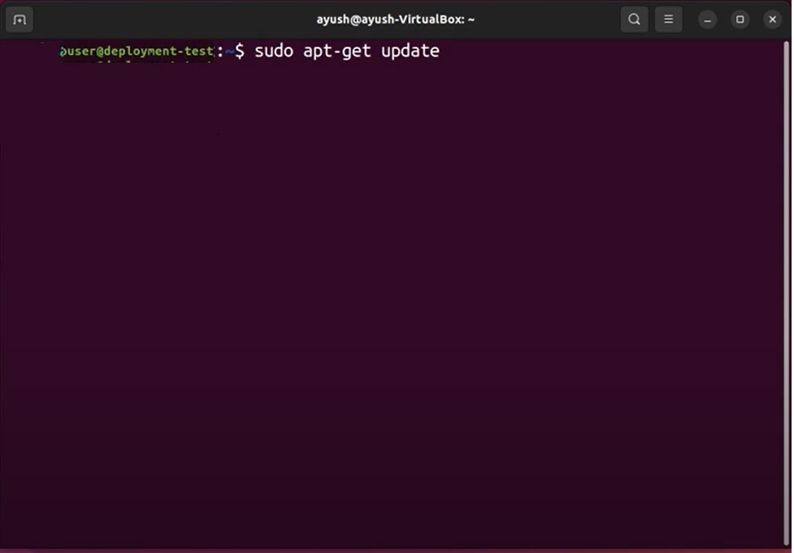
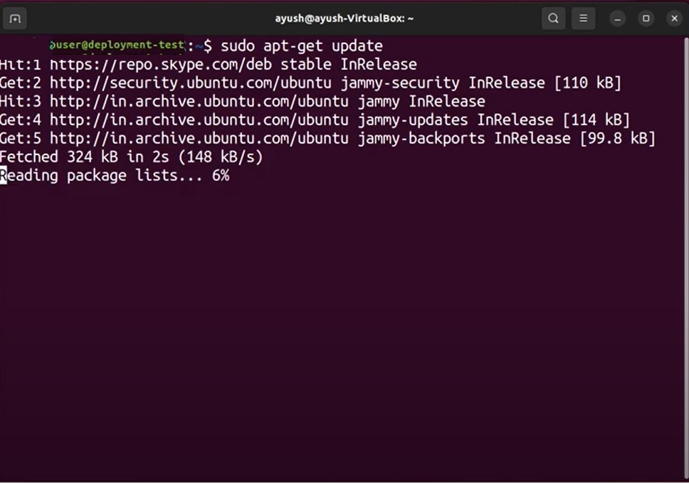
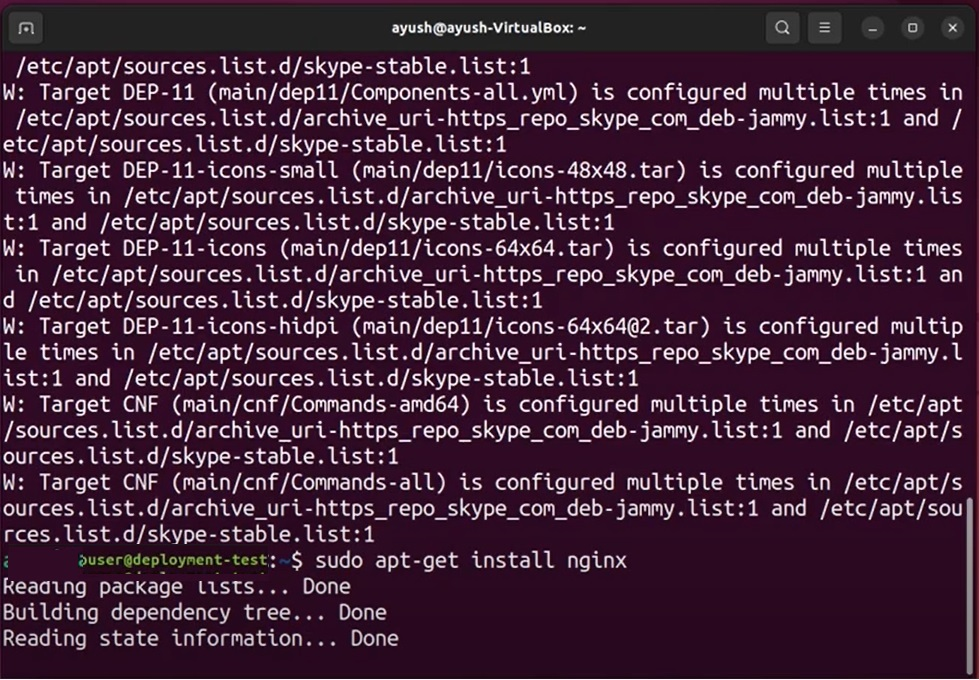
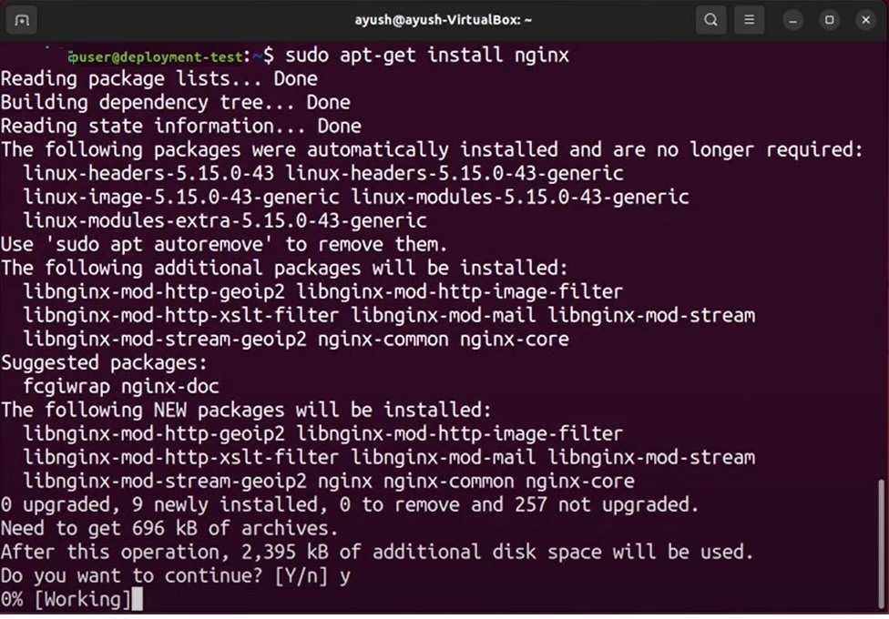
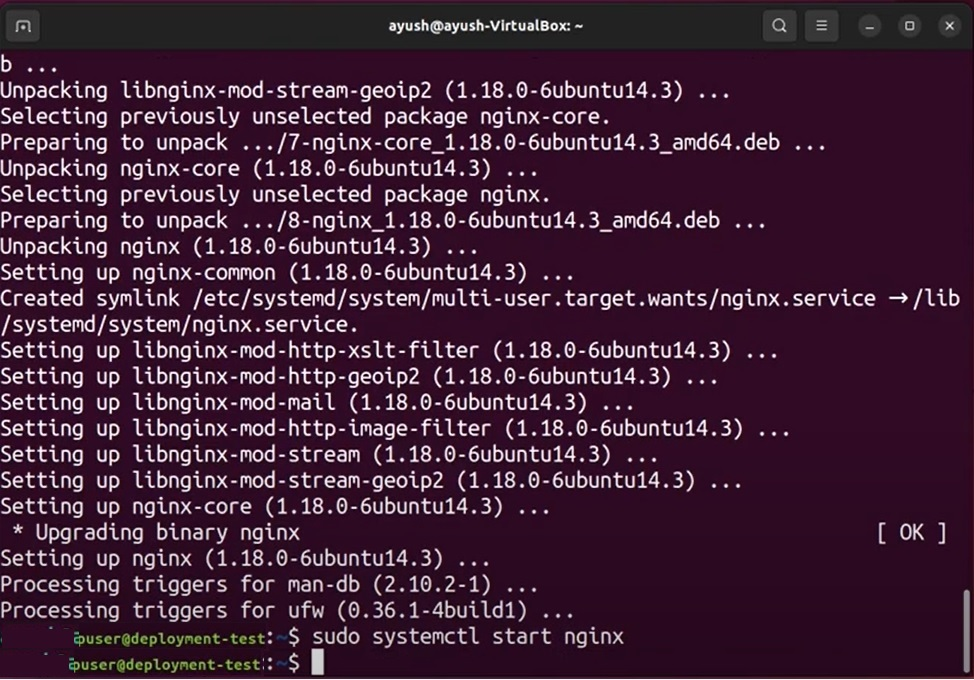
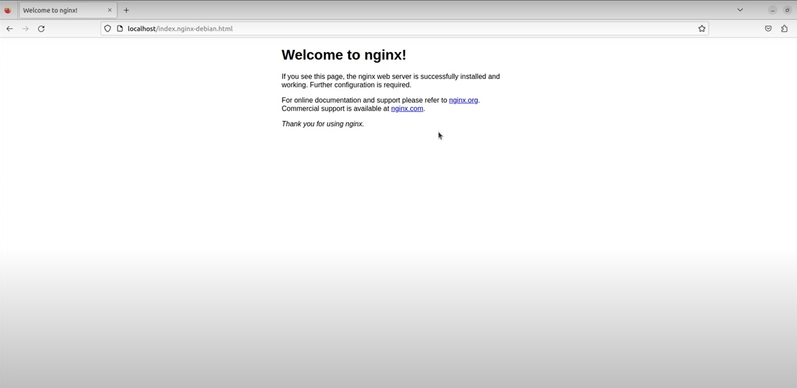
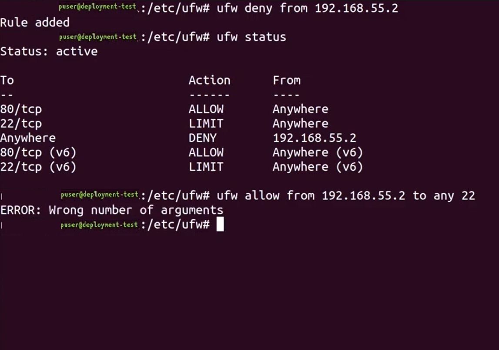

Звіт про виконану роботу.
1. Встановлено та налаштовано вебсервер Nginx через офіційний репозиторій.
  Для виконання цього кроку завдання треба зробити наступні дії.
  
   1.1 Оновити список пакетів:
   
   ```
   
        sudo apt update
		
   ```


     
	
	
	
   1.2 Встановити Nginx:
   
   ```
   
        sudo apt install nginx
		
   ```
   
     
	
	
	
       Підтвердити встановлення, натиснувши Y.
	   
   1.3 Запустити Nginx:
   
   ```
   
        sudo systemctl start nginx
		
   ```
   
    
	
   1.4 Переконатися, що Nginx запускається при завантаженні системи:
   
   ```
   
        sudo systemctl enable nginx
		
   ```
   

   1.5 Перевірити статус Nginx:
   
    ```
	
        sudo systemctl status nginx
    ```

   1.6 Налаштувати брандмауер (ufw):
   
    ```
	
        sudo ufw allow 'Nginx Full'
		
	```

   1.7 Перевірити, чи працює Nginx: Відкрити веб-браузер і перейти за адресою http://your_server_ip. Ви повинні побачити сторінку за замовчуванням Nginx.
   
   
   
   1.8 Налаштувати конфігурації: Файл конфігурації Nginx знаходиться за адресою /etc/nginx/nginx.conf. Внести необхідні зміни та перевірити конфігурацію:
   
   ```
   
        sudo nginx -t
		
   ```

   1.9 Перезапустити Nginx для застосування змін:
   
   ```
   
        sudo systemctl reload nginx
		
   ```

2. Додано та видалено PPA-репозиторій для Nginx.
   Для виконання цього кроку завдання треба зробити наступні дії.
   2.1 Додати PPA-репозиторій для Nginx
     2.1.1 Додати PPA-репозиторій:
	 
	 ```
	 
        sudo add-apt-repository ppa:nginx/stable
        sudo apt update
		
     ```
	 
     2.1.2 Встановити Nginx з PPA:
	 
	 ```
	 
        sudo apt install nginx
		
     ```
	 
   2.2 Видалити PPA-репозиторію та повернутися до офіційної версії
     2.2.1 Встановити ppa-purge:
	 
	 ```
	 
        sudo apt install ppa-purge
		
	 ```

     2.2.2 Видалити PPA-репозиторій та повернутися до офіційної версії Nginx:
	 
	 ```
	 
        sudo ppa-purge ppa:nginx/stable
		
	 ```

3. Написано й налаштовано власний systemd-сервіс для запуску простого скрипта.
   Для виконання цього кроку завдання треба зробити наступні дії.
   3.1 Створити скрипт
         Спочатку створити простий скрипт, який буде записувати дату і час у файл. Для цього, створено файл /usr/local/bin/write_date.sh з наступним вмістом:
		 
        ```
		
           #!/bin/bash
           echo "$(date)" >> /var/log/date.log
		   
        ```
		
         Зроблено скрипт виконуваним:
		 
        ```
		
           sudo chmod +x /usr/local/bin/write_date.sh
		   
		```

   3.2 Створити systemd-сервіс
         Для цього створено файл сервісу /etc/systemd/system/write_date.service з наступним вмістом:
		 
        ```
		
           [Unit]
           Description=Write Date and Time to Log File

           [Service]
           ExecStart=/usr/local/bin/write_date.sh
		   
		```

   3.3 Створити systemd-таймер
         Для цього створено файл таймера /etc/systemd/system/write_date.timer з наступним вмістом:
		 
        ```
		
           [Unit]
           Description=Run write_date.service every minute

           [Timer]
           OnCalendar=*:0/1
           Persistent=true

           [Install]
           WantedBy=timers.target
		   
        ```
		
   3.4 Активувати та запустити таймер
         Для цього активовано таймер, щоб він запускався при завантаженні системи, і запущено його:
		 
        ```
		
           sudo systemctl enable write_date.timer
           sudo systemctl start write_date.timer
		   
		```

   3.5 Перевірити статус таймера
        Для цього я переконався, що таймер працює правильно:
		
        ```
		
           sudo systemctl status write_date.timer
		   
		```

4. Налаштовано брандмауер за допомогою UFW . 
   Для виконання цього кроку завдання треба зробити наступні дії.
   Налаштував UFW і заборонив доступ до порту 22 (SSH) з певного IP, але дозволив з іншого IP:

   4.1 Дозволити доступ до порту 22 (SSH) з певного IP:
   
   ```
   
           sudo ufw allow from <192.168.58.2> to any port 22
		   
    ```

   4.2 Заборонити доступ до порту 22 (SSH) з іншого IP:
   
    ```
	
           sudo ufw deny from <192.168.58.1> to any port 22
		   
    ```

   4.3 Увімкнути UFW:
   
   ```
   
           sudo ufw enable
		   
   ```

   4.4 Перевірити статус UFW:
   
    ```
	
           sudo ufw status
		   
    ```
	
	
		   
5. Налаштовано Fail2Ban для захисту від підбору паролів через SSH.
   Для виконання цього кроку завдання треба зробити наступні дії.

   5.1 Встановити Fail2Ban:
   
    ```
	
          sudo apt update
          sudo apt install fail2ban
		  
    ```

   5.2 Створити локальний конфігураційний файл:
   
     ```
	 
          sudo cp /etc/fail2ban/jail.conf /etc/fail2ban/jail.local
		  
	 ```

   5.3 Редагувати файл jail.local: Відкрити файл для редагування:
   
       ```
	   
          sudo nano /etc/fail2ban/jail.local
		  
	   ```
	   
        Знайти секцію [sshd] і переконатия, що вона виглядає так:
		
		```
		
          [sshd]
          enabled = true
          port = ssh
          logpath = %(sshd_log)s
          maxretry = 5
		  
        ```
		
   5.4 Запустити та увімкнути Fail2Ban:
   
   ```
   
          sudo systemctl start fail2ban
          sudo systemctl enable fail2ban
		  
   ```

   5.5 Перевірити статус Fail2Ban:
   
   ```
   
          sudo fail2ban-client status
          sudo fail2ban-client status sshd
		  
   ```
   
   