1. Створення бази даних та колекцій:

```

use gymDatabase

db.createCollection("clients")
db.createCollection("memberships")
db.createCollection("workouts")
db.createCollection("trainers")

```

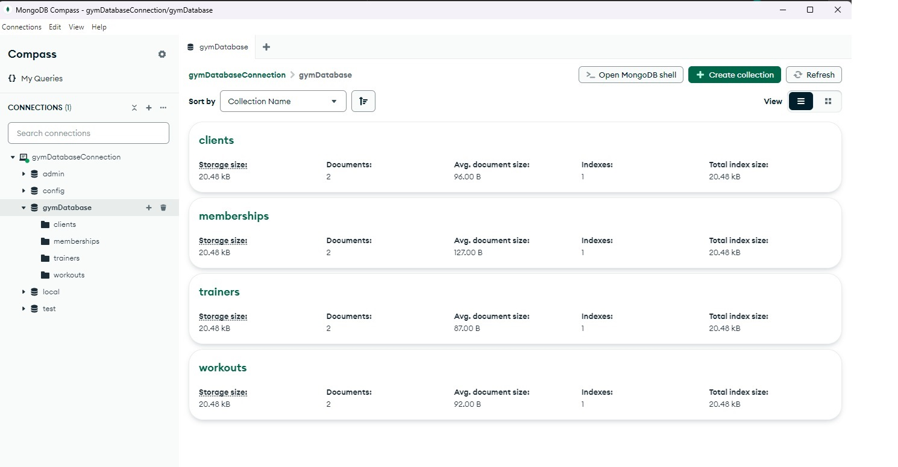

2. Визначення схеми документів: Here's how the documents might look:

Clients:

```

{
    "client_id": 1,
    "name": "John Doe",
    "age": 35,
    "email": "johndoe@example.com"
}

```
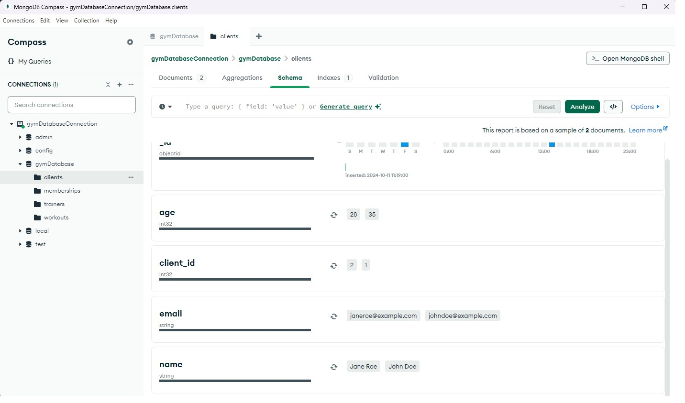


Memberships:

```

{
    "membership_id": 1,
    "client_id": 1,
    "start_date": "2024-01-01",
    "end_date": "2024-12-31",
    "type": "Annual"
}

```
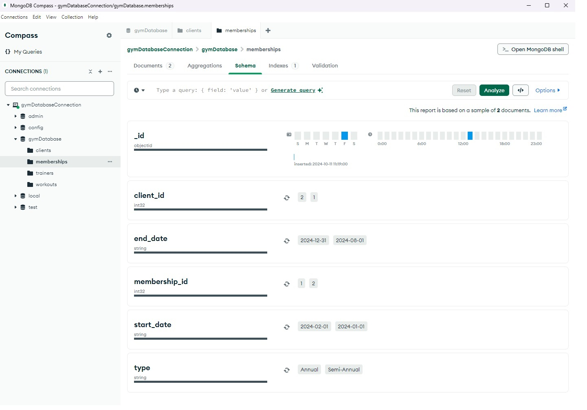


Workouts:

```

{
    "workout_id": 1,
    "description": "Cardio Blast",
    "difficulty": "Medium"
}

```
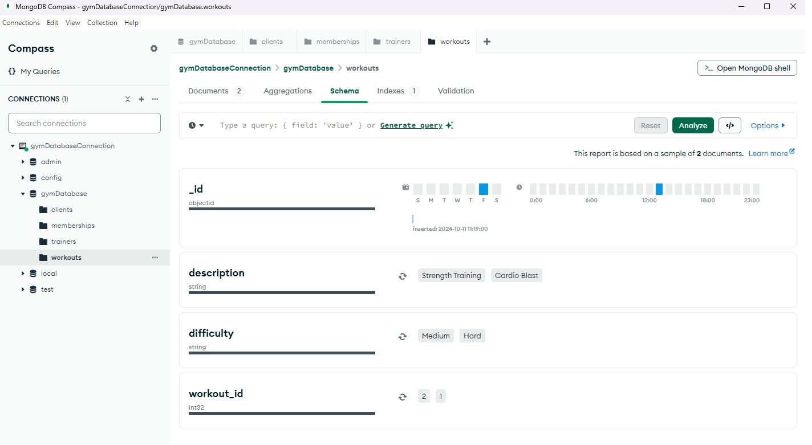


Trainers:

```

{
    "trainer_id": 1,
    "name": "Jane Smith",
    "specialization": "Cardio"
}

```
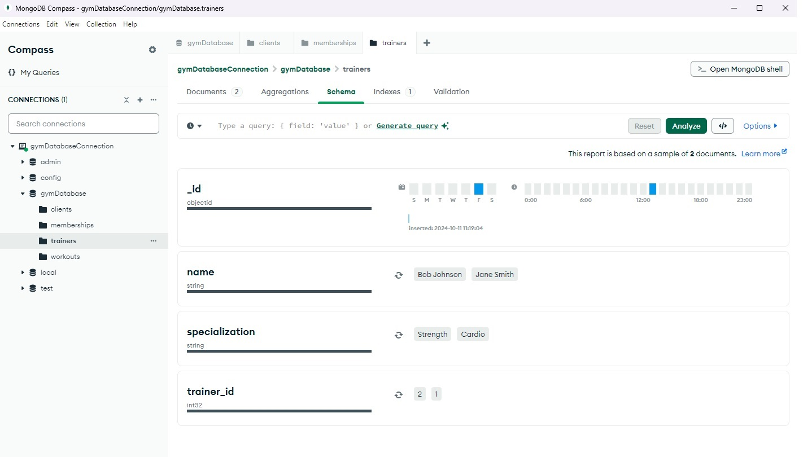


3. Заповнення колекцій даними: Add some sample data to your collections:

```

db.clients.insertMany([
    { "client_id": 1, "name": "John Doe", "age": 35, "email": "johndoe@example.com" },
    { "client_id": 2, "name": "Jane Roe", "age": 28, "email": "janeroe@example.com" }
])

db.memberships.insertMany([
    { "membership_id": 1, "client_id": 1, "start_date": "2024-01-01", "end_date": "2024-12-31", "type": "Annual" },
    { "membership_id": 2, "client_id": 2, "start_date": "2024-02-01", "end_date": "2024-08-01", "type": "Semi-Annual" }
])

db.workouts.insertMany([
    { "workout_id": 1, "description": "Cardio Blast", "difficulty": "Medium" },
    { "workout_id": 2, "description": "Strength Training", "difficulty": "Hard" }
])

db.trainers.insertMany([
    { "trainer_id": 1, "name": "Jane Smith", "specialization": "Cardio" },
    { "trainer_id": 2, "name": "Bob Johnson", "specialization": "Strength" }
])

```

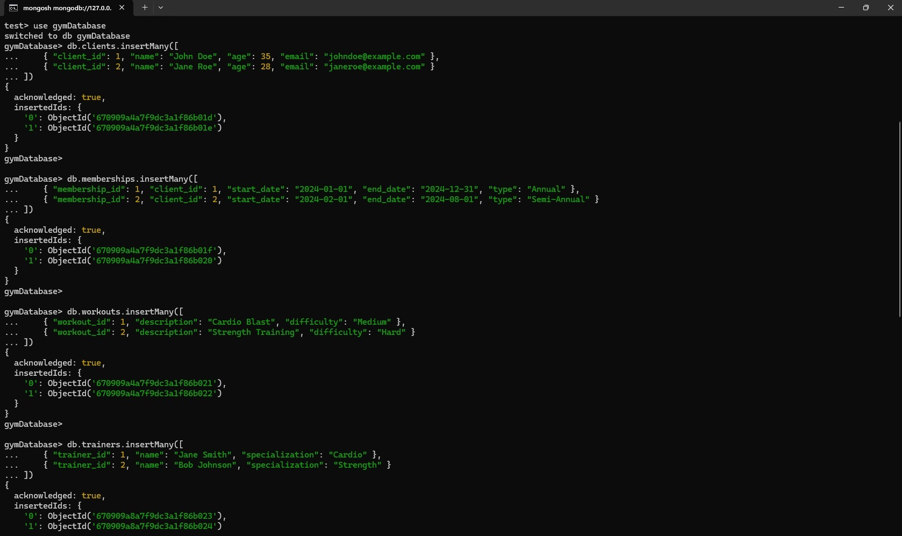

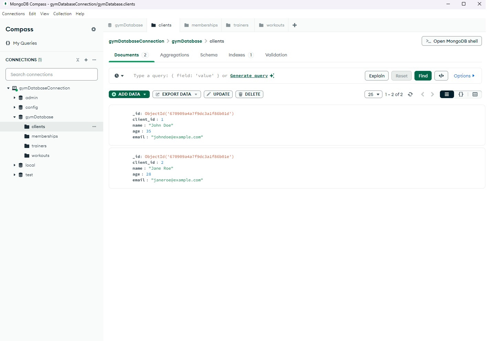

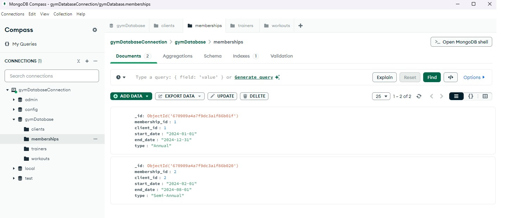

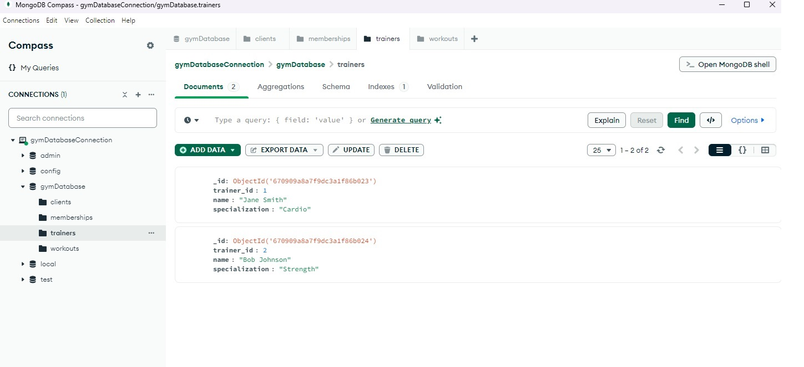

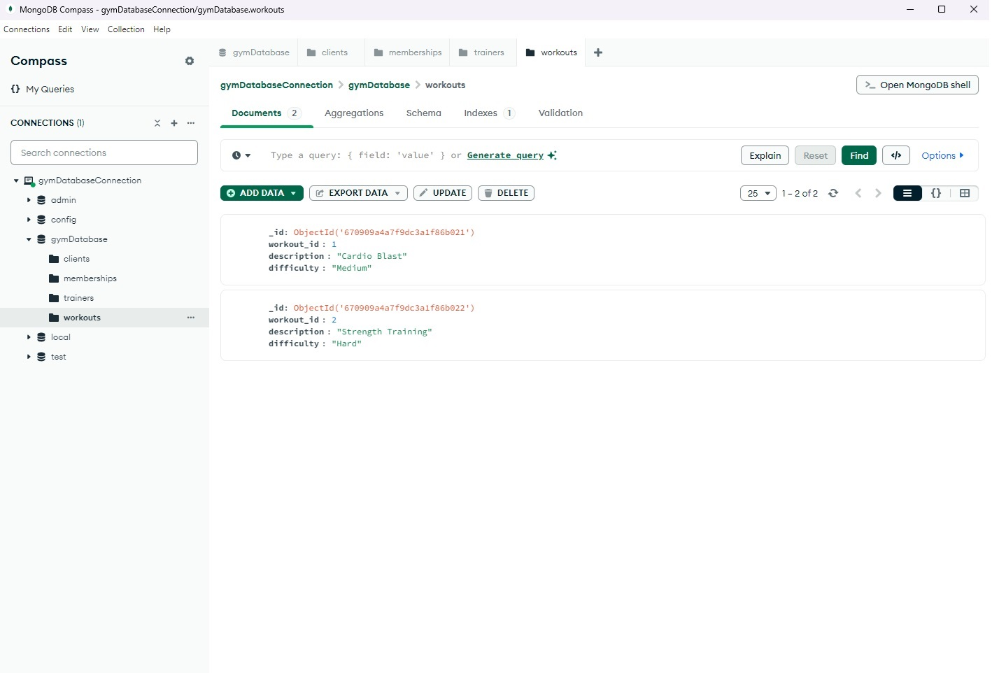


4. Запити:

Знайдіть всіх клієнтів віком понад 30 років:

```

db.clients.find({ "age": { $gt: 30 } })

```
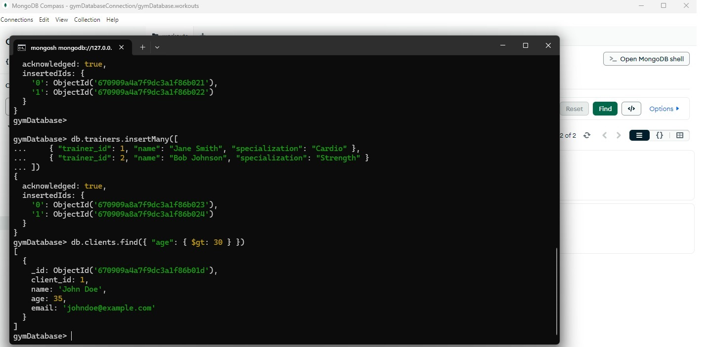


Перелічіть тренування із середньою складністю:

```

db.workouts.find({ "difficulty": "Medium" })

```
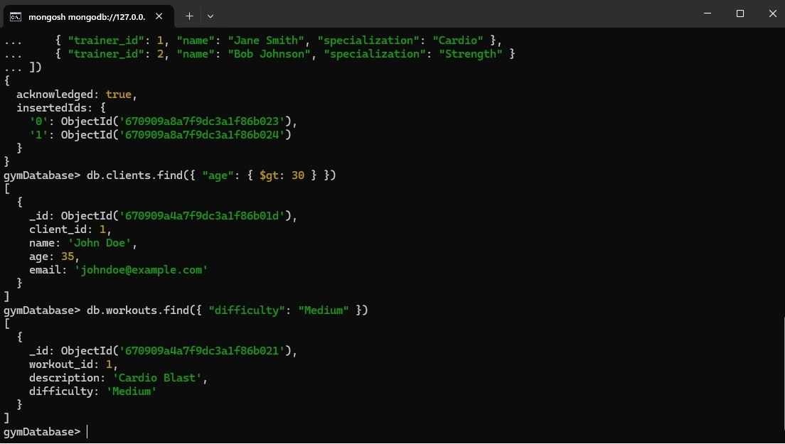


Покажіть інформацію про членство клієнта з певним client_id:

```

db.memberships.find({ "client_id": 1 })
There you go! If you need more help or want to add some complex queries, let me know.

```
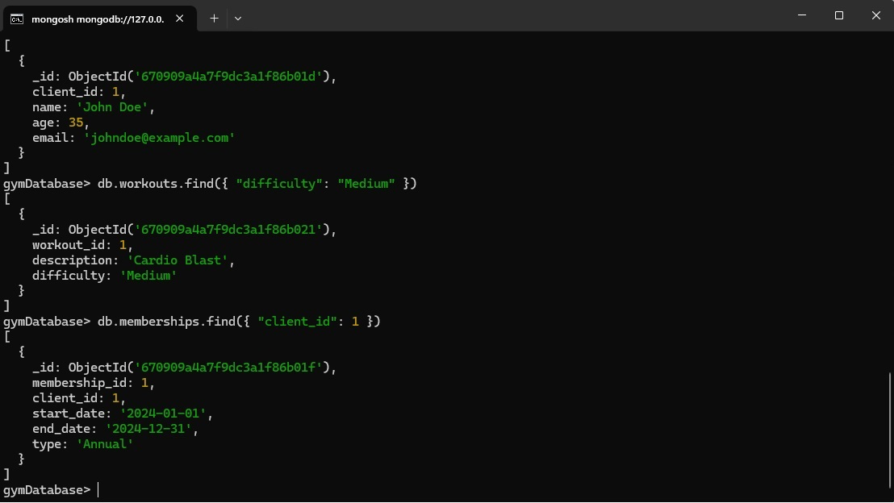

