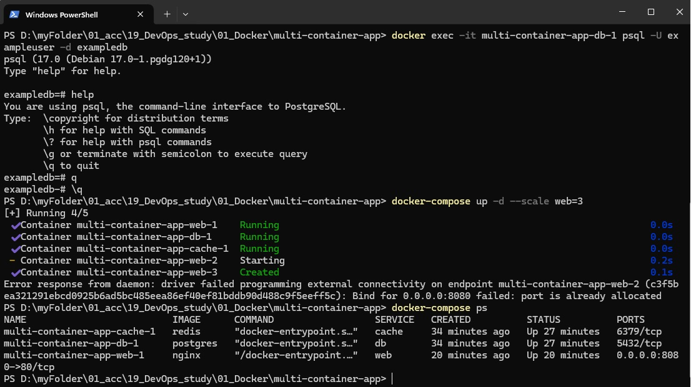

1. Завдання 1: Встановлення Docker
  Докер встановлено

2. Завдання 2: Створення файлу docker-compose.yml 

  2.1. Створіть новий каталог для вашого проєкту:
  * Назвіть його, наприклад, multi-container-app


  2.2. Створіть docker-compose.yml файл:
  * У цьому файлі буде визначено конфігурацію для вебсервера, бази даних та кешу
  * Додайте до docker-compose.yml файлу образи nginx, postgres та redis
  * Додайте volume db-data для postgresql, та web-data для nginx
  * Додайте спільну мережу appnet
  * Створіть файл index.html з простим змістом
 
   Дивіться в доданій папці multi-container-app файли docker-compose.yml and index.html

3. Завдання 3: Запуск багатоконтейнерного застосунку

 3.1. Запустіть застосунок за допомогою Docker Compose:
  * Використовуйте команду docker-compose up -d для запуску всіх сервісів у фоновому режимі

```

docker-compose up -d

```


 3.2. Перевірте стан запущених сервісів:
  * Застосовуйте команду docker-compose ps для перегляду стану запущених контейнерів

```

docker-compose ps

```


Дивіться на малюнку вище.

 3.3. Перевірте роботу вебсервера:
  * Відкрийте браузер та перейдіть за адресою http://localhost:8080. Ви повинні побачити сторінку nginx.

 


4. Завдання 4: Налаштування мережі й томів

4.1. Досліджуйте створені мережі та томи:
  * Використовуйте команди docker network ls та docker volume ls для перегляду створених мереж і томів

```

docker network ls

```


```

docker volume ls

```


4.2. Перевірте підключення до бази даних:
  * Застосовуйте команду docker exec для підключення до бази даних PostgreSQL всередині контейнера. <db_container_id> можна отримати з команди docker-compose ps.

```

docker exec -it multi-container-app-db-1 psql -U exampleuser -d exampledb

```


5. Завдання 5: Масштабування сервісів

5.1. Масштабуйте вебсервер:
  * Використовуйте команду docker-compose up -d --scale web=3 для запуску трьох екземплярів вебсервера

```

docker-compose up -d --scale web=3

```




5.2. Перевірте стан масштабованих сервісів:
  * Використовуйте команду docker-compose ps для перегляду стану запущених контейнерів

```

docker-compose ps

```
Дивіться малюнок вище


