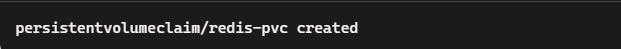
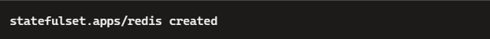
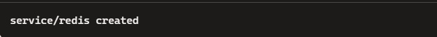
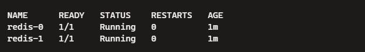
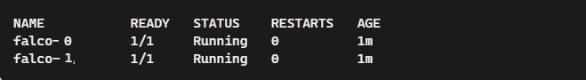
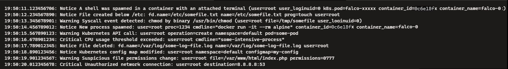

Report about home work for the K8.

Завдання 1: Створення StatefulSet для Redis-кластера

Кроки:

1. Створіть PersistentVolumeClaim (PVC) для зберігання даних Redis. Кожен под у StatefulSet використовуватиме свій окремий том для зберігання даних.
    1.1 Create the YAML File:

    In terminal, open an editor:

```

nano persistent-volume-claim.yaml

```
    1.2 Create the YAML Configuration:

    The editor is open, and I created the content provided in the file "persistent-volume-claim.yaml".
    
    1.3 Save and Exit the Editor:

       In nano, press Ctrl+O to write the file, and Ctrl+X to exit.
    

    1.4  Apply the PVC Configuration:

       I run the following command:
```

kubectl apply -f persistent-volume-claim.yaml

```
     Screen output:




2. Створіть StatefulSet для Redis із налаштуваннями для запуску двох реплік. Кожна репліка повинна мати стабільне ім’я та доступ до постійного тому.
  2.1 Create the YAML File:

       Open the editor:
```

nano redis-statefulset.yaml

```
  2.2 Add YAML Configuration:

      I pasted the following StatefulSet configuration in the "redis-statefulset.yaml" file.

  2.3 Save and Exit the Editor:

      In nano, press Ctrl+O to write the file, and Ctrl+X to exit.
  2.4 Apply the StatefulSet Configuration:

      I run the following command:
```

kubectl apply -f redis-statefulset.yaml

```
      Screen output:



3. Створіть Service для Redis: Service для StatefulSet потрібен для доступу до Redis. Використовуйте тип Service ClusterIP для внутрішньої взаємодії між подами.
   3.1 Create the YAML File:

       Open the editor:
```

nano redis-service.yaml

```
    
    3.2 Create YAML Configuration:

       I pasted the following Service configuration in the "redis-service.yaml" file.

    3.3 Save and Exit the Editor:

        In nano, press Ctrl+O to write the file, and Ctrl+X to exit.

    3.4 Apply the Service Configuration:

        I run the following command:
```

kubectl apply -f redis-service.yaml

```
    Screen output:
    


4. Перевірка роботи: після створення StatefulSet перевірте, чи запущені поди (kubectl get pods) і чи мають вони стабільні імена, наприклад, redis-0, redis-1. Застосовуйте команду kubectl exec для підключення до кожного пода та перевірки збереження даних між перезапусками.
   4.1 Check Pods:

    I run the following command:
```

kubectl get pods

```

Screen output:
    


    4.2 Check Pod Names:

         The pod names aree stable and look like redis-0 and redis-1.
    4.3 Connect to Each Pod:

     I run the following command:
```

kubectl exec -it redis-0 -- redis-cli


```
Screen output:
    
- connected to the Redis CLI inside redis-0

     Repeat for redis-1:
    
      I run the following command:
```

kubectl exec -it redis-1 -- redis-cli


```
Screen output:
    
- connected to the Redis CLI inside redis-1


 Завдання 2: Налаштування Falco в Kubernetes за допомогою DaemonSet

1. Налаштуйте DaemonSet для Falco:
  * Розробіть конфігурацію DaemonSet, яка розгорне Falco на кожному вузлі. Falco повинен працювати з привілейованим доступом для моніторингу системних викликів.
2. Налаштуйте монтування системних директорій: для того, щоб Falco міг правильно збирати системні події, потрібно змонтувати такі директорії:
  * /proc — директорія, що містить інформацію про запущені процеси, це треба для доступу до процесів на вузлі
  * /boot — може містити дані про конфігурації ядра, що дає змогу Falco краще розпізнавати події
  * /lib/modules — тут розташовані модулі ядра, доступ до них дозволяє Falco використовувати eBPF для збору даних
  * /var/run/docker.sock — дає Falco доступ до Docker-сокета для контролю подій, пов’язаних з контейнерами — важливо, якщо вузол використовує Docker як рантайм
  * /usr — дозволяє доступ до системних бібліотек і утиліт, необхідних для розширення функціональності Falco
3. Обмежте використання ресурсів:
  * Для Falco потрібно встановити обмеження на застосування ресурсів (CPU і пам’ять), щоб він не впливав на роботу інших сервісів на вузлі
  * Встановіть, наприклад, 100m CPU і 256Mi пам’яті як ліміти, а також 100m CPU і 128Mi пам’яті як мінімальні запити
4. Створіть YAML-файл конфігурації DaemonSet:
  * Створіть YAML-файл, який відповідає вимогам і запускає Falco на кожному вузлі
  * Переконайтеся, що всі потрібні директорії змонтовані для коректної роботи Falco

For the chapters 1-4 - the steps defined below.
    4.1 Create the YAML File: I open a text editor to create the Falco DaemonSet YAML file:

```

nano falco-daemonset.yaml


```
   4.2 Paste the YAML Configuration: I pasted the following content into the file as it fefined in the attached "falco-daemonset.yaml" file.
   4.3 Apply the DaemonSet Configuration: I run the following command to apply the YAML file:

```

kubectl apply -f falco-daemonset.yaml


```
Screen output:
    


5. Перевірка розгортання та роботи Falco:

Після застосування YAML-файлу за допомогою команди kubectl apply -f falco-daemonset.yaml

  * Перевірте, чи всі поди Falco запущені на кожному вузлі kubectl get pods -l app=falco -n kube-system
  * Переконайтеся, що кожен под Falco працює в статусі Running

    5.1 Check if Falco Pods are Running on Each Node: I run the following command:

```

kubectl get pods -l app=falco -n kube-system


```

Screen output:
    



6.  Перевірка логів Falco для виявлення подій:

  * Виконайте команду для перегляду логів одного з подів Falco kubectl logs -l app=falco -n kube-system
  * Переконайтеся, що Falco генерує сповіщення про події — логи можуть містити інформацію про такі дії, як-от доступ до файлів, створення нових процесів або взаємодія з Docker
    
    6.1 View Logs of a Falco Pod: I run the following command:

```

kubectl logs -l app=falco -n kube-system


```

Screen output:
    


