1. Створення та налаштування VPC

* Створіть нову VPC:
  * Використайте консоль AWS для створення VPC.
  * Виберіть CIDR-блок
* Створіть дві підмережі в VPC:
  * Створіть одну публічну підмережу з CIDR-блоком.
  * Створіть одну приватну підмережу з CIDR-блоком.
* Створіть та налаштуйте інтернет-шлюз (Internet Gateway):
  * Прив'яжіть інтернет-шлюз до вашої VPC.
  * Налаштуйте таблиці маршрутизації для забезпечення доступу до інтернету з публічної підмережі.
Step 1: Create and Configure VPC
1.1 Create a New VPC
Open the AWS Management Console and go to the VPC dashboard.

Click on Create VPC.

Name the VPC and select a CIDR block, for example, 10.0.0.0/16.

Click Create.

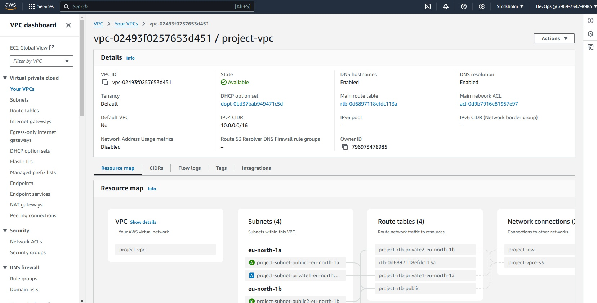

Step 1.2: Create Two Subnets in the VPC with Unique CIDR Blocks
Public Subnet:

Navigate to the Subnets section in the VPC dashboard.

Click Create Subnet.

Select the VPC you created, name it (e.g., Public Subnet), and use a CIDR block like 10.0.50.0/24.

Click Create.

Private Subnet:

Click Create Subnet again.

Select the same VPC, name it (e.g., Private Subnet), and use a different CIDR block like 10.0.60.0/24.

Click Create.

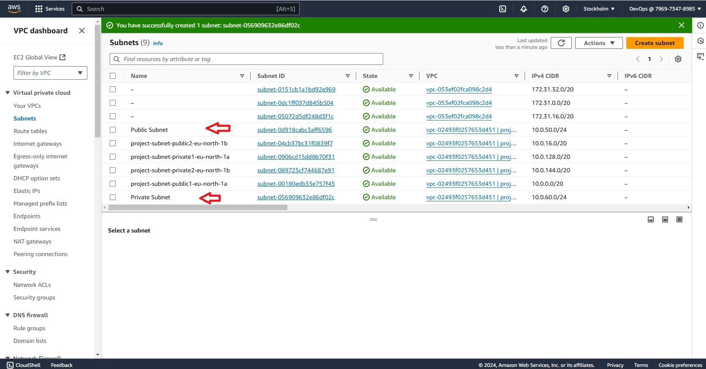

Step 1.3: Create and Attach an Internet Gateway
Go to the Internet Gateways section and click Create Internet Gateway.

Name the internet gateway and click Create.

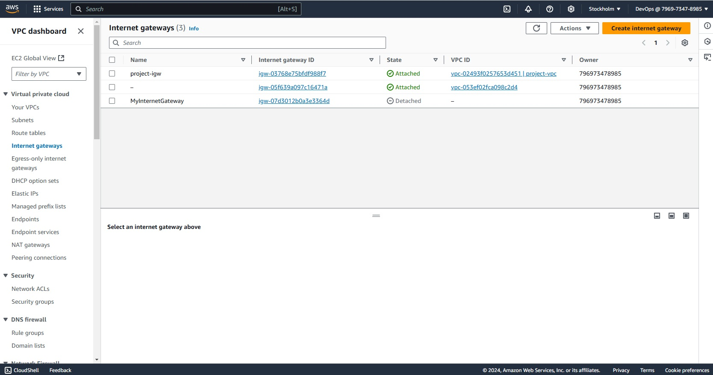

After creating, select the internet gateway and click Actions > Attach to VPC.

Select your VPC and attach it.

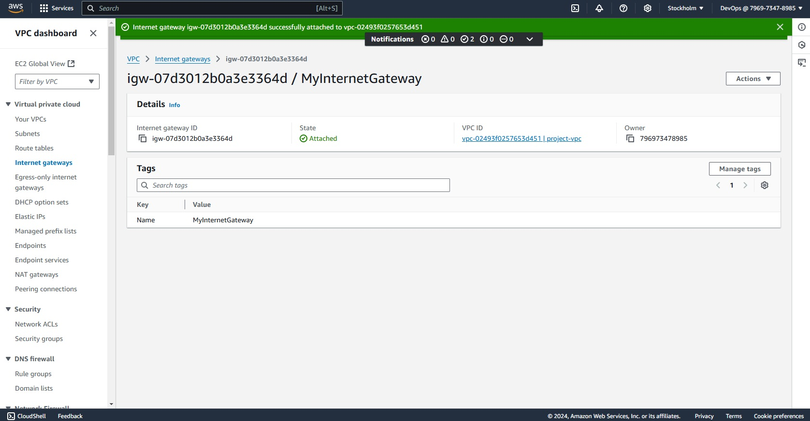

Step 1.4: Configure Route Tables
Go to the Route Tables section.

Select the main route table associated with your VPC.

Under Routes, click Edit routes, then Add route.

Destination: 0.0.0.0/0

Target: Select the Internet Gateway.

Click Save routes.

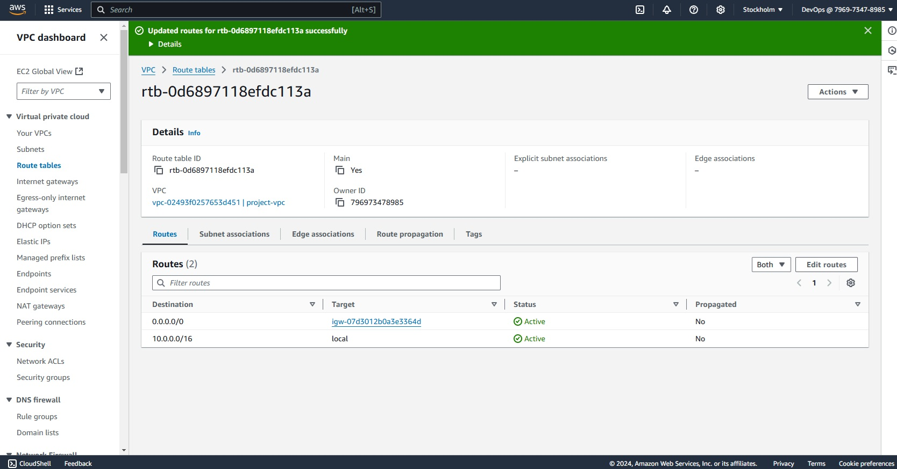

Associate the Public Subnet with the Route Table:

Go to the Subnets section and select your Public Subnet.

Under Route Table, click Edit route table association.

Select the main route table and click Save.

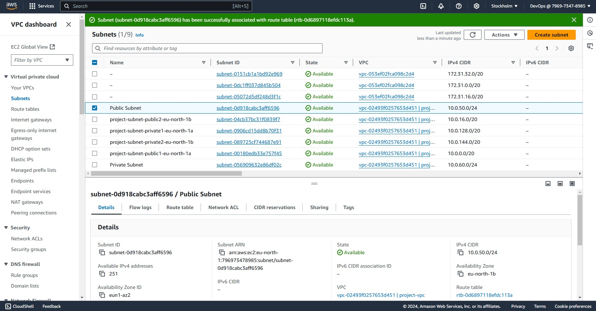

2. Налаштування груп безпеки (Security Groups) та списків контролю доступу (ACL)

* Додайте правила для дозволу вхідного HTTP та SSH трафіку з будь-якої IP-адреси.

Step 2: Configure Security Groups and ACLs
Create a Security Group:

Go to the Security Groups section in the VPC dashboard.

Click Create Security Group.

Name the security group (e.g., MySecurityGroup) and select your VPC.

Add inbound rules:

Type: HTTP, Protocol: TCP, Port Range: 80, Source: Anywhere (0.0.0.0/0)

Type: SSH, Protocol: TCP, Port Range: 22, Source: Anywhere (0.0.0.0/0)

Click Create Security Group.

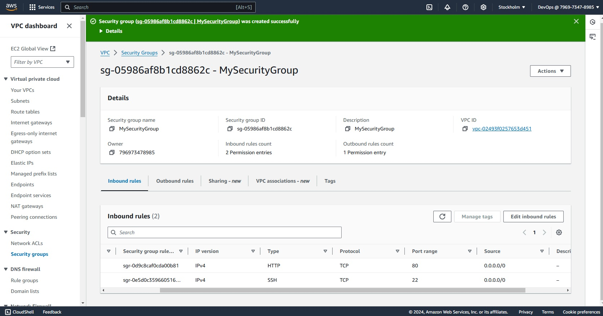

3. Запуск інстансу EC2

* Запустіть новий інстанс EC2:
  * Використайте Amazon Linux 2 AMI.
  * Виберіть тип інстансу, наприклад, t2.micro. Оскільки він безкоштовний.
  * Прив'яжіть інстанс до публічної підмережі.
  * Використайте Security Group, створену на попередньому кроці.
  * Завантажте та використайте SSH-ключ для доступу до інстансу.
  
  Step 3: Launch an EC2 Instance
Launch an Instance:

Go to the EC2 dashboard.

Click Launch Instance.

Select Amazon Linux 2 AMI.

Choose the t2.micro instance type (free tier eligible).

Configure Instance Details:

Network: Select your VPC.

Subnet: Select the Public Subnet.

Add Storage and configure as needed (default is usually fine).

Add Tags if desired.

Configure Security Group:

Select the security group you created.

Review and Launch.

Create a new key pair, download it, and use it for SSH access.

Click Launch Instance.

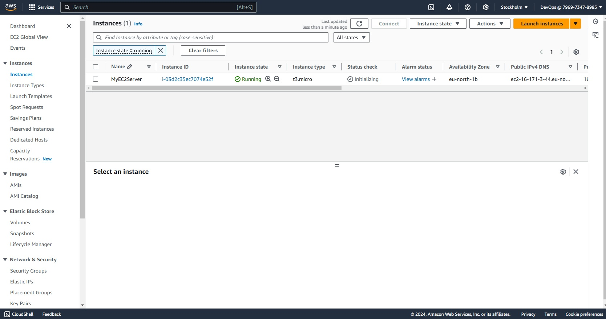

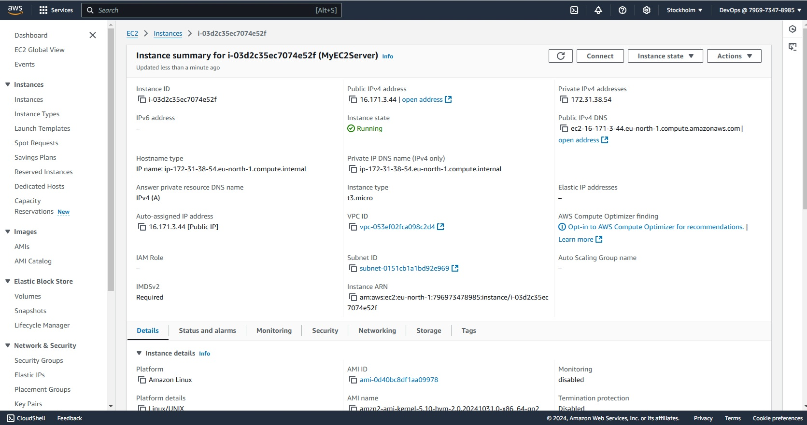

4. Призначення еластичної IP-адреси (EIP)

* Створіть та призначте EIP до вашого інстансу:
  * Створіть нову EIP в AWS консолі.
  * Прив'яжіть EIP до запущеного інстансу EC2.
  
  Step 4: Assign an Elastic IP (EIP)
Create and Assign an Elastic IP:

Go to the Elastic IPs section in the EC2 dashboard.

Click Allocate Elastic IP address.

Click Allocate.

Select the allocated Elastic IP and click Actions > Associate Elastic IP address.

Select your instance and private IP.

Click Associate.

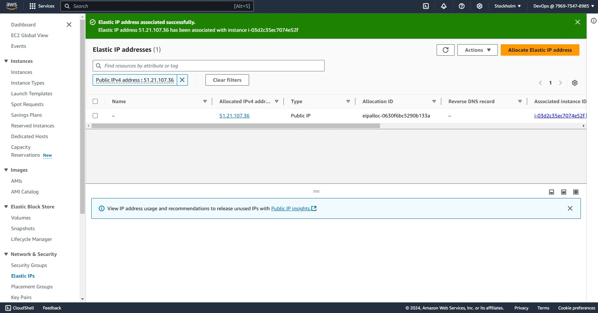

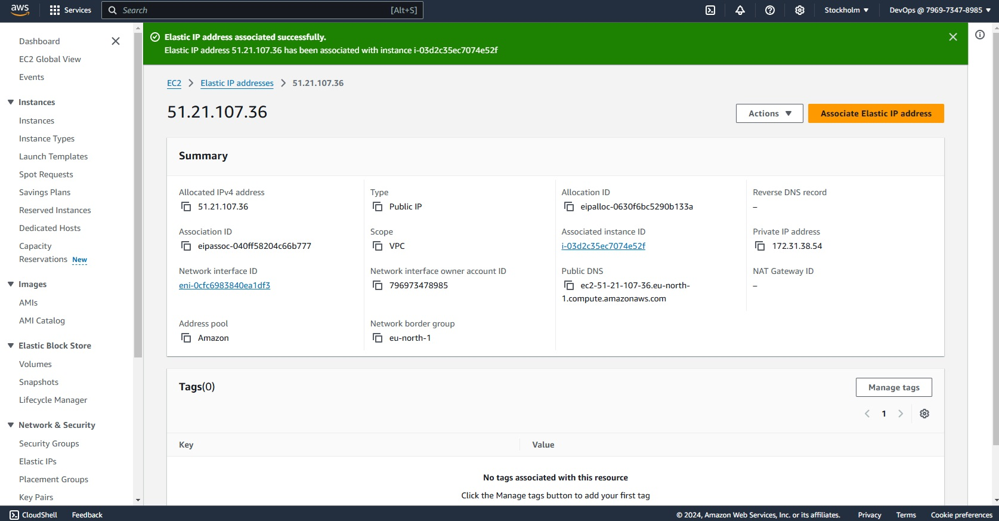
