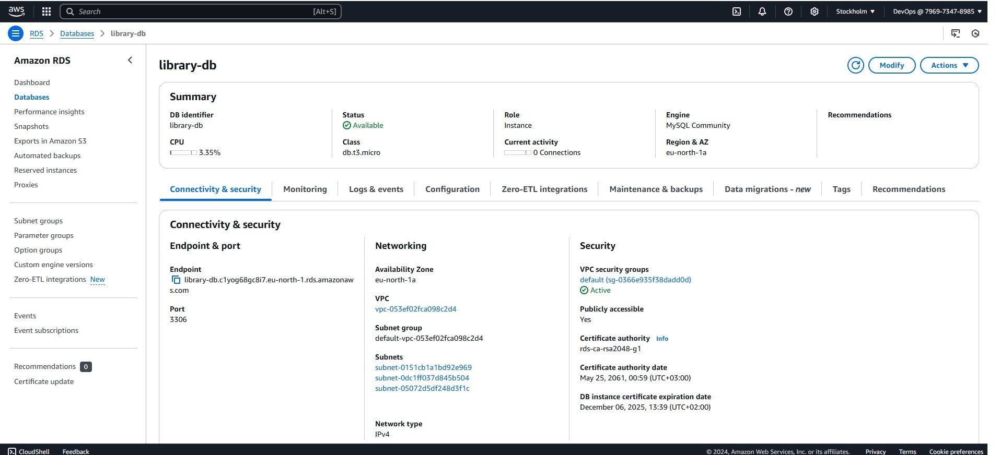
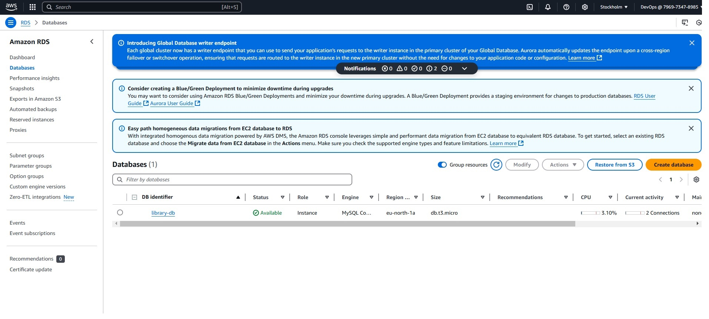
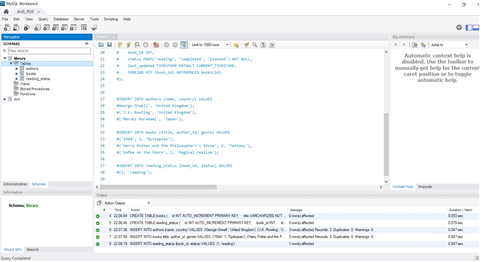
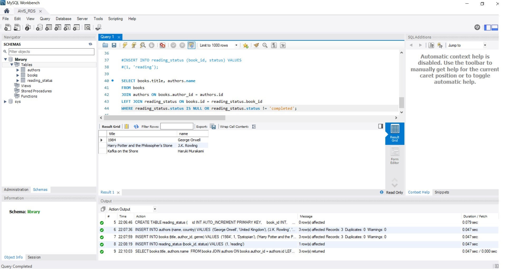
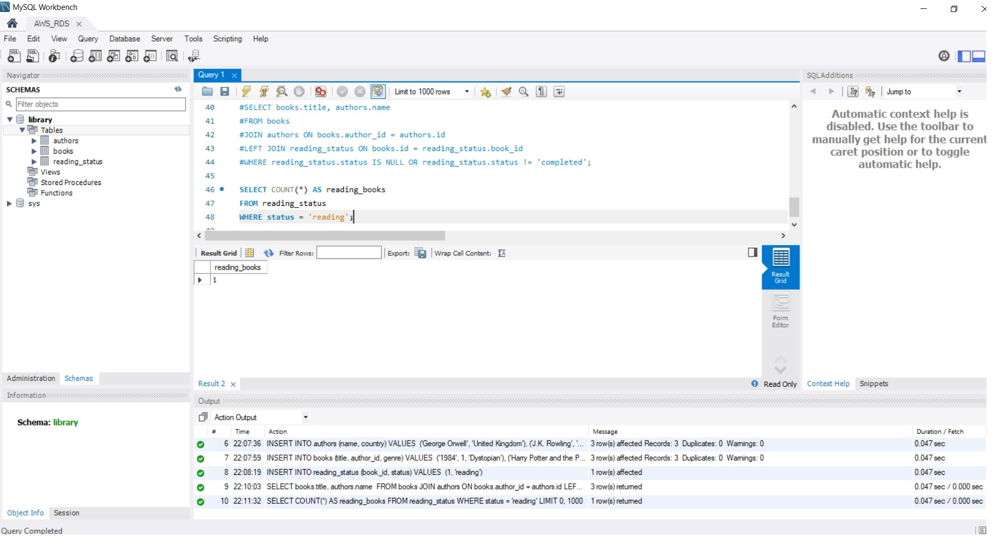
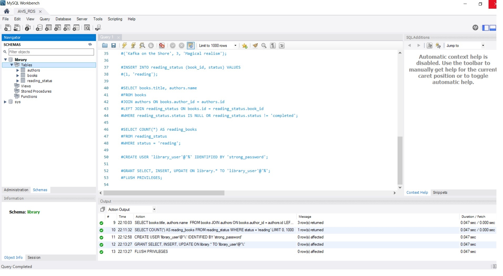
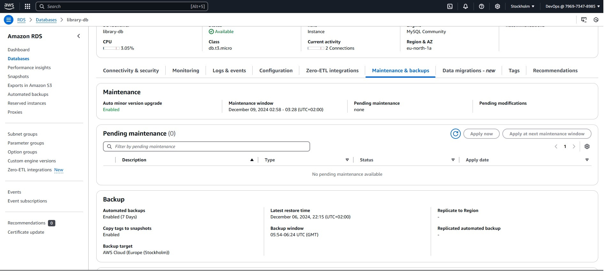
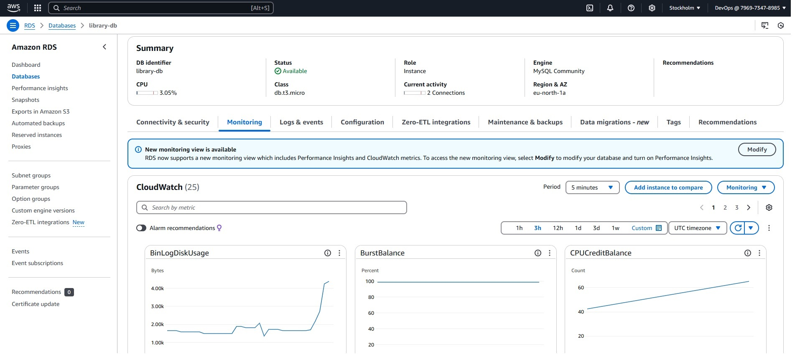

Report about home work for the AWS RDS.

1. Створення RDS інстансу

1. Увійдіть до AWS Management Console
2. Відкрийте сервіс RDS та створіть інстанс бази даних:
  * Виберіть Create database
  * Тип бази: MySQL (можна обрати PostgreSQL за бажанням)
  * Шаблон: Free tier
  * Конфігурація:
    * DB instance identifier: library-db
    * Master username: admin
    * Master password: створіть надійний пароль
    * DB instance class: db.t3.micro
    * Дисковий простір: 20 ГБ (General Purpose SSD)
    * Увімкніть Public access для підключення до бази з вашого комп'ютера
  * У розділі Network & Security:
    * Виберіть існуючу VPC або створіть нову
    * Додайте нову security group, що дозволяє доступ лише з вашого IP
3. Дочекайтесь завершення створення інстансу.

2. Підключення до бази

1. Під'єднайтеся до бази даних за допомогою SQL-клієнта (наприклад, MySQL Workbench)
2. Використовуйте параметри підключення, надані в RDS (адреса хоста, порт 3306, ім'я користувача admin та пароль)

3. Створення бази даних та таблиць

Створіть базу даних library:

sql

CREATE DATABASE library;
USE library;

Створіть три таблиці для зберігання даних про авторів, книги та статус читання:

Таблиця №1

CREATE TABLE authors (
    id INT AUTO_INCREMENT PRIMARY KEY,
    name VARCHAR(255) NOT NULL,
    country VARCHAR(255)
);
Таблиця №2

CREATE TABLE books (
    id INT AUTO_INCREMENT PRIMARY KEY,
    title VARCHAR(255) NOT NULL,
    author_id INT,
    genre VARCHAR(50),
    FOREIGN KEY (author_id) REFERENCES authors(id)
);
Таблиця №3

CREATE TABLE reading_status (
    id INT AUTO_INCREMENT PRIMARY KEY,
    book_id INT,
    status ENUM('reading', 'completed', 'planned') NOT NULL,
    last_updated TIMESTAMP DEFAULT CURRENT_TIMESTAMP,
    FOREIGN KEY (book_id) REFERENCES books(id)
);

4. Внесення даних

Додайте кількох авторів:

sql

INSERT INTO authors (name, country) VALUES 
('George Orwell', 'United Kingdom'),
('J.K. Rowling', 'United Kingdom'),
('Haruki Murakami', 'Japan');

Додайте кілька книг:

sql

INSERT INTO books (title, author_id, genre) VALUES 
('1984', 1, 'Dystopian'),
('Harry Potter and the Philosopher\'s Stone', 2, 'Fantasy'),
('Kafka on the Shore', 3, 'Magical realism');

Додайте статус для однієї з книг:

sql

INSERT INTO reading_status (book_id, status) VALUES 
(1, 'reading');

5. Виконання запитів

Знайдіть всі книги, які ще не прочитані:

sql

SELECT books.title, authors.name 
FROM books
JOIN authors ON books.author_id = authors.id
LEFT JOIN reading_status ON books.id = reading_status.book_id
WHERE reading_status.status IS NULL OR reading_status.status != 'completed';

Визначте кількість книг, які в процесі читання:

sql

SELECT COUNT(*) AS reading_books
FROM reading_status
WHERE status = 'reading';

6. Налаштування доступу

Створіть нового користувача для бази даних:

sql

CREATE USER 'library_user'@'%' IDENTIFIED BY 'strong_password';

Надайте йому права:

sql

GRANT SELECT, INSERT, UPDATE ON library.* TO 'library_user'@'%';
FLUSH PRIVILEGES;

7. Моніторинг та резервне копіювання

1. Увімкніть автоматичне резервне копіювання у налаштуваннях RDS (Backup retention period: 7 днів).

2. Перегляньте метрики вашого інстансу в CloudWatch (CPU utilization, connections, IOPS).

