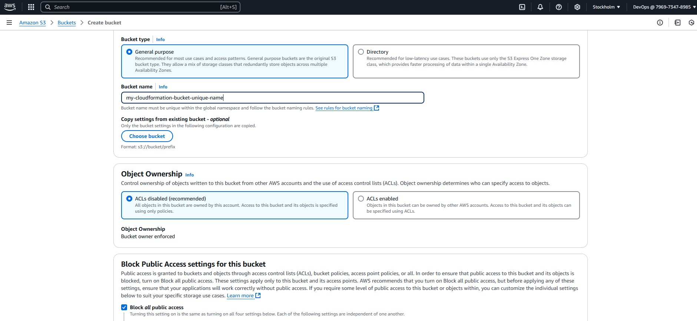
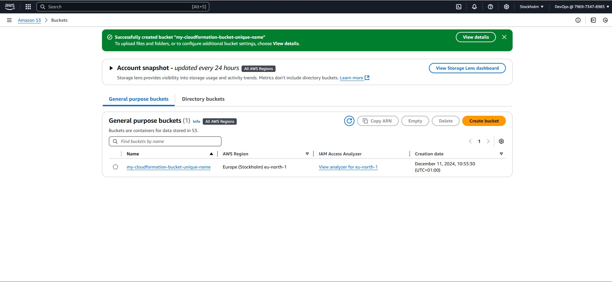
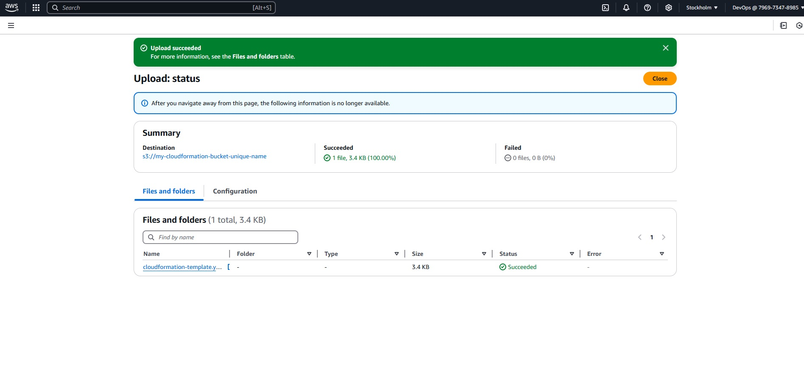
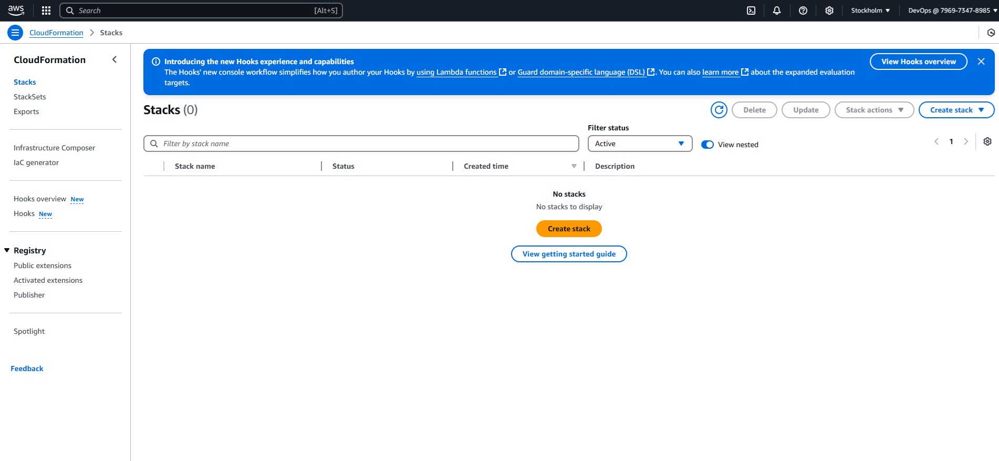
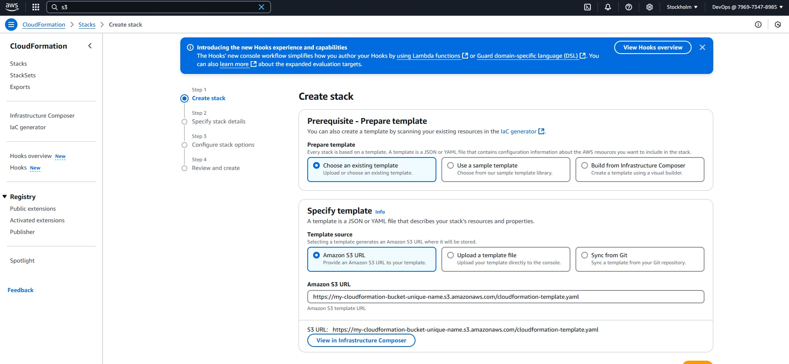
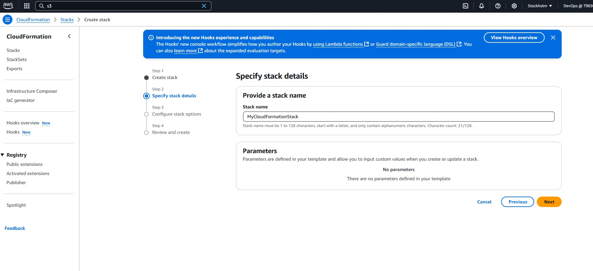
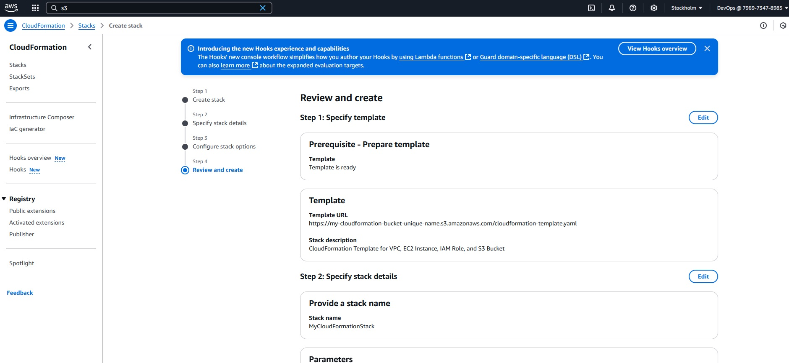
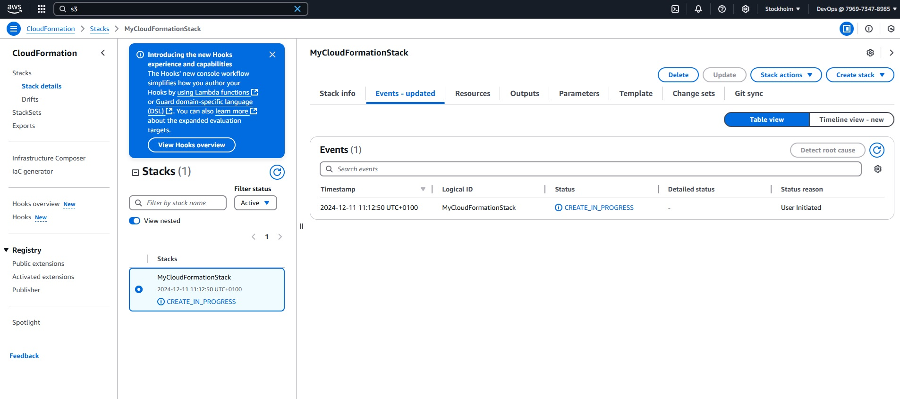
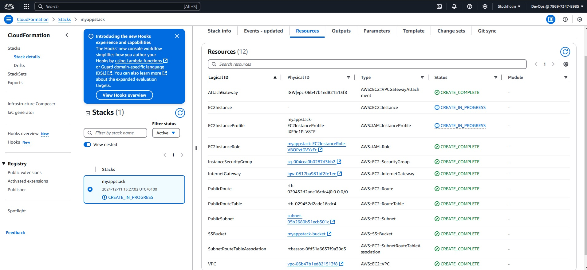

Steps to Implement the CloudFormation Template:
1. Save the YAML File:

 - Save the provided CloudFormation template in a file named cloudformation-template.yaml.

2. Open the AWS Management Console:

 - Go to the AWS Management Console and log in.

3. Navigate to CloudFormation:

 - In the Services menu, search for CloudFormation and select it.

4. Create a New Stack:

 - Click on Create stack.

 - Choose With new resources (standard).

5. Upload the Template:

 - In the Specify template section, select Upload a template file.

 - Click Choose file and select the cloudformation-template.yaml file you saved earlier.

 - Click Next.

6. Specify Stack Details:

 - Enter a Stack name ( MyCloudFormationStack).

 - Add any Tags if necessary.

 - Click Next.

7. Configure Stack Options:

 - Configure any additional stack options if needed.

 - Click Next.

8. Review and Create Stack:

 - Review the stack details and click Create stack.

9. Monitor Stack Creation:

   - CloudFormation will begin creating the resources. You can monitor the progress in the Events tab of the stack.

