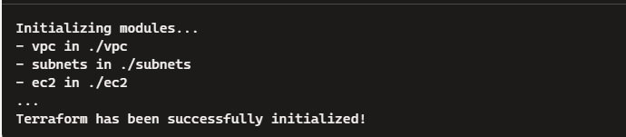

terraform-project/
│
├── versions.tf        # Specifies required versions of Terraform and providers
├── main.tf            # Main configuration file
│
├── vpc/
│   └── main.tf        # VPC module
│
├── subnets/
│   └── main.tf        # Subnets module
│
└── ec2/
    └── main.tf        # EC2 instances module


Крок 1:Створення модулів Terraform
Модуль для VPC:
-Створено каталог vpc і файл main.tf у ньому.

Модуль для підмереж:
-Створено каталог subnets і файл main.tf у ньому.

Модуль для EC2-інстансів:
-Створено каталог ec2 і файл main.tf у ньому.

Крок 2: Використання модулів в основному конфігураційному файлі
-Створено основний файл main.tf у кореневому каталозі.


```

$ terraform init


```

вивід:



```

$ terraform plan


```

вивід:


```

$ terraform apply


```

вивід:


Крок 3: Імпорт наявних ресурсів у Terraform

1)Створeнo ресурси вручну у AWS Management Console (VPC, субнети, EC2 інстанси).

2)Використано команду terraform import для імпорту цих ресурсів у Terraform конфігураційні файли.

```

$ terraform import aws_vpc.main vpc-12345678


```

вивід:


```

$ terraform import aws_subnet.public subnet-12345678


```

вивід:


```

$ terraform import aws_instance.public i-12345678


```

вивід:


3)Переконайтися, що Terraform створює ідентичну інфраструктуру, використовуючи команду terraform plan та terraform apply.

```

$ terraform plan


```

вивід:


```

$ terraform apply


```

вивід:

