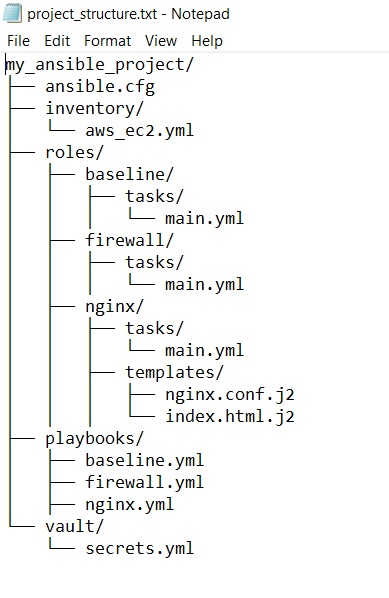
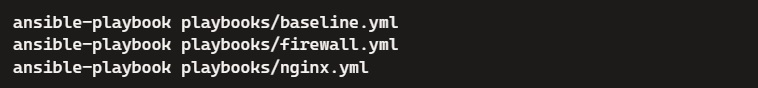
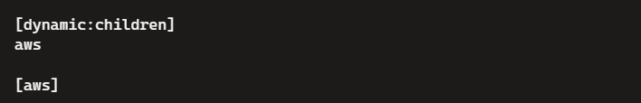

Створено проект, структуру якого показано на малюнку нижче.

Спочатку розпишемо, що було створено для цього проекту

1) Налаштовано Ansible

Створено файл ansible.cfg у корені проекту

2) Створено динамічний інвентар

Створіть файл aws_ec2.yml у каталозі inventory

3) Створено файли ролей

- baseline/tasks/main.yml
- firewall/tasks/main.yml
- nginx/tasks/main.yml
- nginx/templates/nginx.conf.j2
- nginx/templates/index.html.j2

4) Створено Playbooks

- playbooks/baseline.yml
- playbooks/firewall.yml
- playbooks/nginx.yml

5) Шифрування конфіденційних даних за допомогою Ansible Vault

   Створено файл vault/secrets.yml і зашифровано його за допомогою Ansible Vault
   
   

6) Запустити Playbooks можна так
  
   
   
Тепер по пунктах домашнього завдання

1. Створення ролі "baseline" для базових налаштувань серверів
  * Налаштування SSH-ключів
  * Встановлення базових пакетів (vim, git, mc, ufw)
  
  - дивіться доданий файл my_ansible_project/roles/baseline/tasks/main.yml
  
2. Створення ролі для налаштування firewall
  * Налаштування базових правил firewall за допомогою ufw
  
  - дивіться доданий файл my_ansible_project/roles/firewall/tasks/main.yml
  
3. Створення ролі для налаштування Nginx
  * Встановлення Nginx
  
  - дивіться доданий файл my_ansible_project/roles/nginx/tasks/main.yml
  
  * Налаштування конфігураційного файлу та розгортання index.html з використанням шаблонів та змінних
  
  - дивіться доданий файл my_ansible_project/roles/nginx/tasks/main.yml
  
4. Застосування dynamic inventory для управління інфраструктурою
  * Налаштування dynamic inventory для AWS
  
  Для використання dynamic inventory з AWS, знадобиться плагін aws_ec2
  
  
  
5.  Використання Ansible Vault для шифрування конфіденційних даних
  * Шифрування конфіденційних даних (наприклад, паролів) за допомогою Ansible Vault
  
  - дивіться доданий файл my_ansible_project/vault/secrets.yml
  
6. Сконфігуруйте декілька playbooks для різних ситуацій з наявних ролей

  - дивіться додані файли:
     - my_ansible_project/playbooks/baseline.yml
     - my_ansible_project/playbooks/firewall.yml
     - my_ansible_project/playbooks/nginx.yml
	 
	 