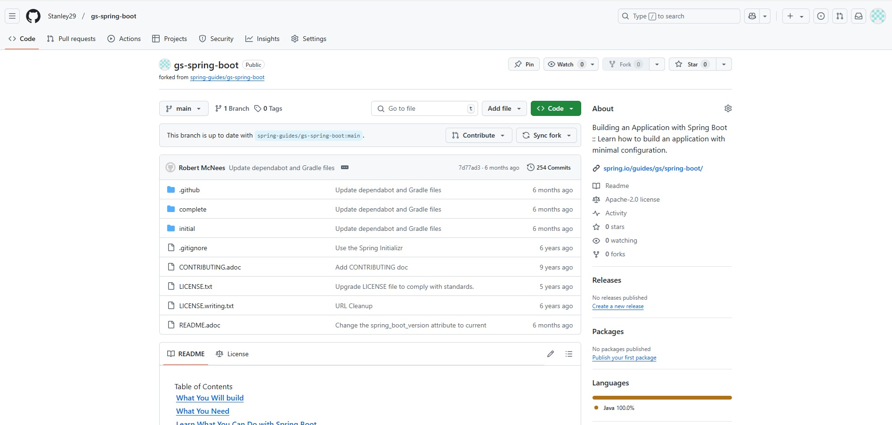
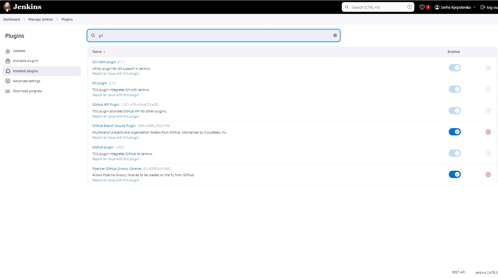
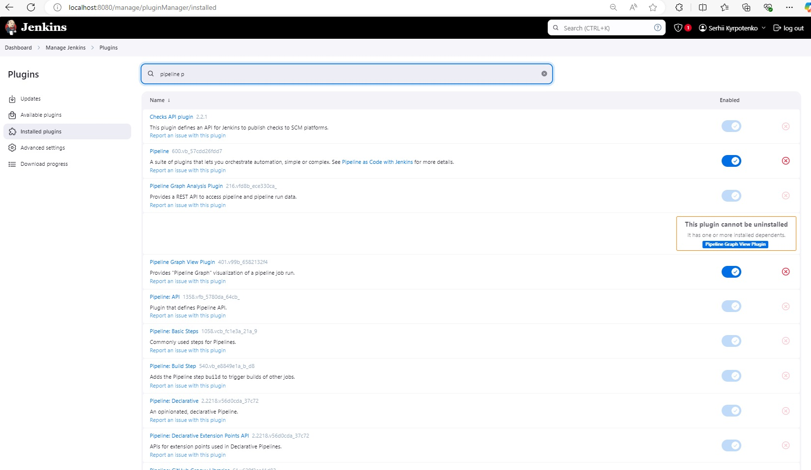
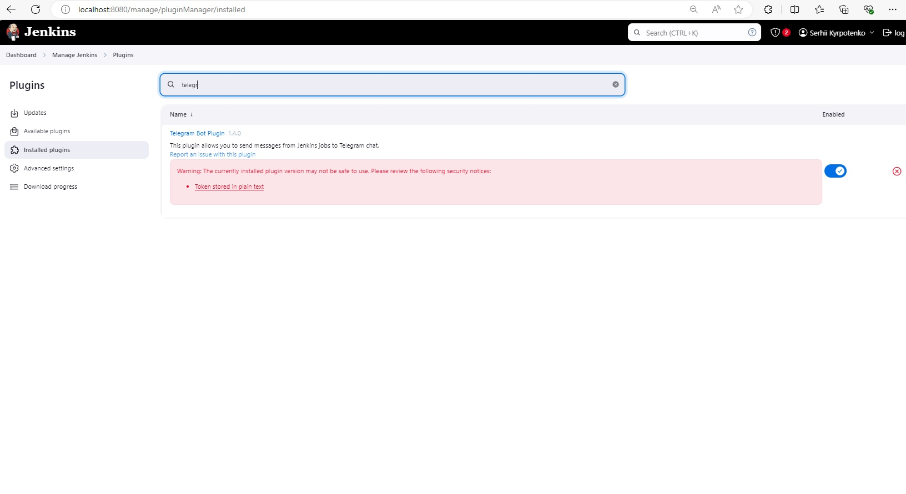
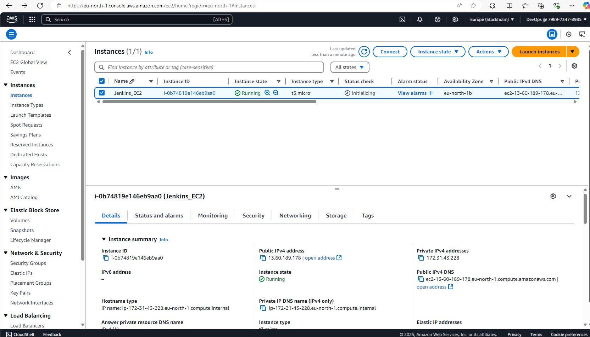
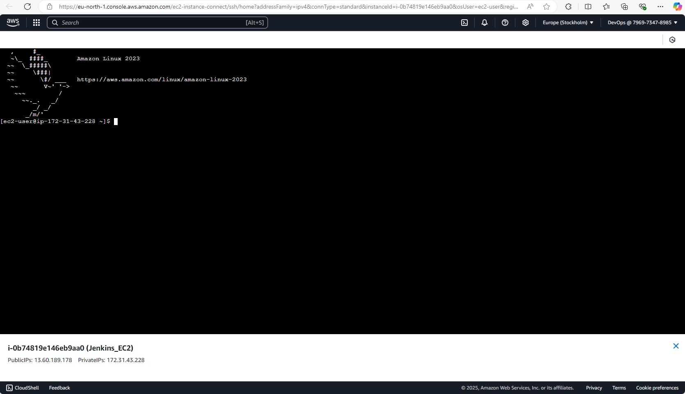
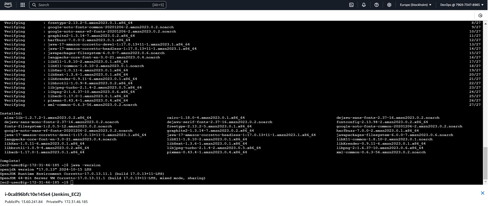
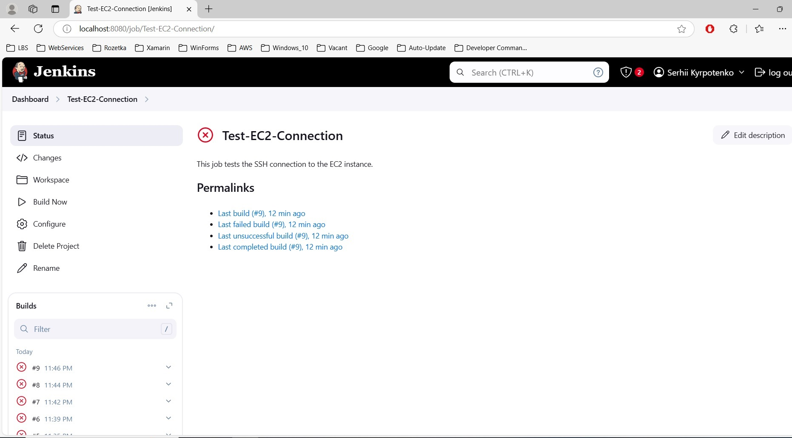

Основний проєкт

Візьмемо простий Java-проєкт на основі Maven. Використовуйте репозиторій Spring Boot Example Application.

1. Форкніть проєкт:
  * Зайдіть у репозиторій gs-spring-boot і форкніть його у свій GitHub-акаунт
  * Клонувати локально не обов’язково — Jenkins автоматично звантажить репозиторій під час виконання завдань
   
   

📌 Завдання 1: Деплой Jenkins

Запустіть Jenkins на вашому локальному сервері або в Docker:

1. Додайте плагіни:
  * Git Plugin
  * Pipeline Plugin
  * Telegram Notification Plugin (для завдання з нотифікаціями)
  
    
	
	
	
	
	
📌 Завдання 2: Налаштувати EC2

1. Створіть інстанс Amazon EC2 (Amazon Linux 2 або Ubuntu).
	
   
	 
	 Налаштуйте SSH-доступ і встановіть Java та переконайтеся, що ваш Jenkins може підключатися до EC2 через SSH.
	 
	 SSH-доступ і Java встановлено успішно
	 
	 
	 
	 
	 
	 В іншому я переконався, що дженкінс не здатний виконувати навіть базові команди консолі, які успішно проходять коли їх запускають в консолі.
	 Тому, я не зміг рухатися далі.
	 
	 