Step 1: Set Up Infrastructure
  1. Create EC2 Instances on AWS:

     - Monitoring Server:

        - Instance Type: t3.small

        - Open ports: 22 (SSH), 9090 (Prometheus), 3000 (Grafana), 3100 (Loki)

     - Web Server or Database Server:

        - Instance Type: t3.micro

        - If Web Server: Install Nginx and open ports 22 (SSH), 80 (Nginx), 9100 (Node Exporter)

        - If Database Server: Install MySQL and open ports 22 (SSH), 3306 (MySQL), 9100 (Node Exporter)

     - Ensure both servers are in the same VPC.
	 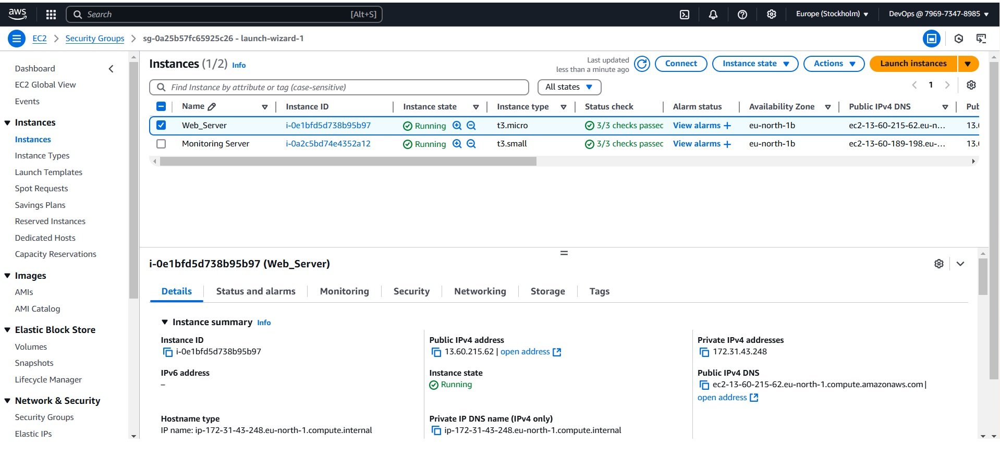
	 
	 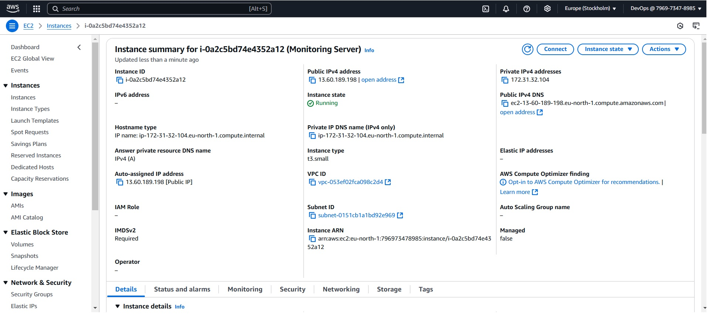
	 
	 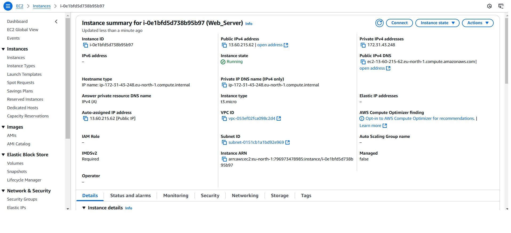
	 

Step 2: Install Docker and Docker Compose	 
   1. On the Monitoring Server:

     - Install Docker:
	 
	 ```

     sudo apt-get update
     sudo apt-get install -y docker.io
     sudo systemctl start docker
     sudo systemctl enable docker

     ```
	 
	 - Install Docker Compose:
	 
	 ```

     sudo curl -L "https://github.com/docker/compose/releases/download/1.29.2/docker-compose-$(uname -s)-$(uname -m)" -o /usr/local/bin/docker-compose
     sudo chmod +x /usr/local/bin/docker-compose


     ```
	 
	 
Step 3: Deploy Monitoring Services
   1. Create a Docker Compose File:

     - Create a file named docker-compose.yml - see attached file.
	 
   2. Create Prometheus Configuration File:

     - Create a file named prometheus.yml - see attached file.
	 
   3. Create Loki Configuration File:

     - Create a file named loki-config.yml - see attached file.
	 
   4. Create Promtail Configuration File:

     - Create a file named promtail-config.yml - see attached file.
   5. Start the Services:

     - Run the following command to start all services: 
	 
	 ```	 
	 sudo docker-compose up -d
	 
	 ```

Step 4: Set Up Web Server or Database Server
   1.  Install Node Exporter:

     - Download Node Exporter:	 

	 ```	 
	 wget https://github.com/prometheus/node_exporter/releases/download/v1.2.2/node_exporter-1.2.2.linux-amd64.tar.gz
     tar xvfz node_exporter-1.2.2.linux-amd64.tar.gz
     sudo mv node_exporter-1.2.2.linux-amd64/node_exporter /usr/local/bin/
	 ```
     - Create a systemd service for Node Exporter:
	 
	 ```
	 sudo tee /etc/systemd/system/node_exporter.service <<EOF
     [Unit]
     Description=Node Exporter
     After=network.target
     [Service]
     User=nodeusr
     ExecStart=/usr/local/bin/node_exporter
     [Install]
     WantedBy=default.target
     EOF
	 
	 ```
     - Start and enable Node Exporter:
	 
	 ```
	 
	 sudo systemctl daemon-reload
     sudo systemctl start node_exporter
     sudo systemctl enable node_exporter
	 
	 ```
	 
   2. Install Promtail:

     - Download Promtail: 
	 
	 ```
	 
	 wget https://github.com/grafana/loki/releases/download/v2.2.1/promtail-linux-amd64.zip
     unzip promtail-linux-amd64.zip
     sudo mv promtail-linux-amd64 /usr/local/bin/promtail
	 
	 ```
	 
	 - Create a systemd service for Promtail:
	 
	 ```
	 
	 sudo tee /etc/systemd/system/promtail.service <<EOF
     [Unit]
     Description=Promtail
     After=network.target
     [Service]
     User=promtail
     ExecStart=/usr/local/bin/promtail -config.file=/etc/promtail/promtail-config.yml
     [Install]
     WantedBy=default.target
     EOF
	 
	 ```
	 
	 - Start and enable Promtail:
	 
	 ```
	 
	 sudo systemctl daemon-reload
     sudo systemctl start promtail
     sudo systemctl enable promtail

	 ```
	 
   3. Detailed Architecture Diagram
   
   Key Interactions
     - Prometheus Scrapes Node Exporter:

        - Prometheus on the monitoring server scrapes metrics from the Node Exporter running on the monitored server.

     - Promtail Collects Logs:

        - Promtail on the monitored server collects logs (system logs and service-specific logs like Nginx or MySQL).

        - Promtail sends these logs to Loki on the monitoring server.

     - Grafana Visualizes Data:

        - Grafana queries metrics from Prometheus.

        - Grafana queries logs from Loki.

        - Dashboards in Grafana provide visualizations for both metrics and logs.
		
		
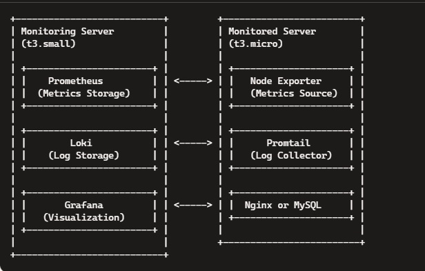
	
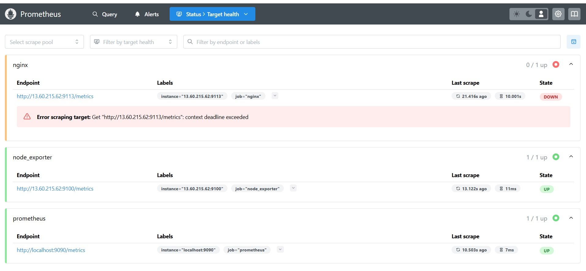
	
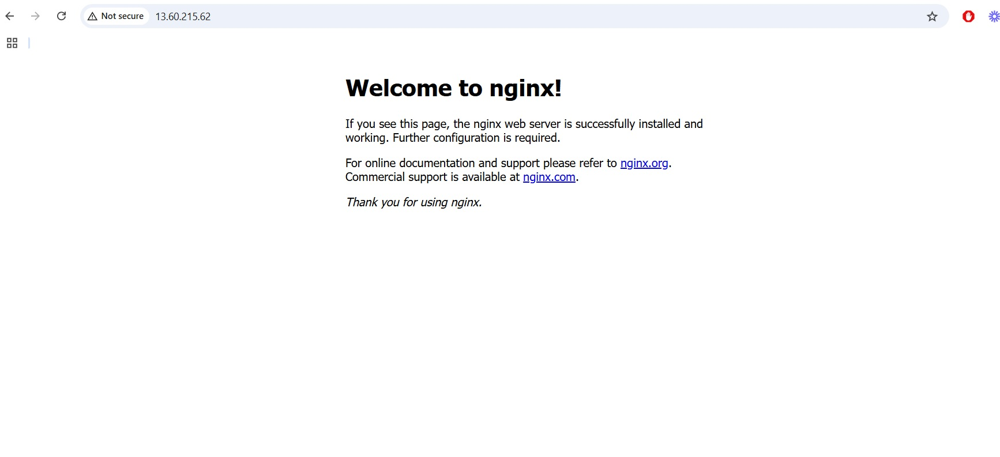
	
Step 5: Configure Grafana
    1. Access Grafana:

       - Open your browser and navigate to http://<Monitoring_Server_IP>:3000.

    2. Add Data Sources:

       - Prometheus:

         - URL: http://13.60.189.198:9090

       - Loki:

          - URL: http://13.60.189.198:3100

    3. Import Dashboards:

       - Node Exporter Dashboard (ID: 1860)

       - Nginx Dashboard (if monitoring a web server)

       - Loki Logs Explorer
	   
	   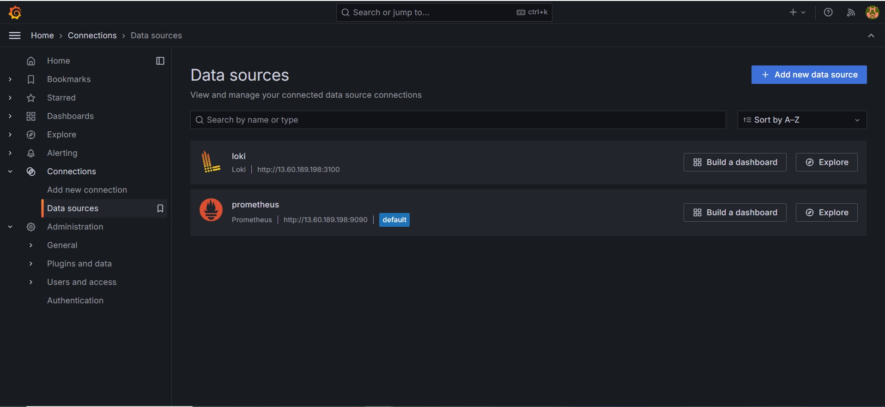
	   
	   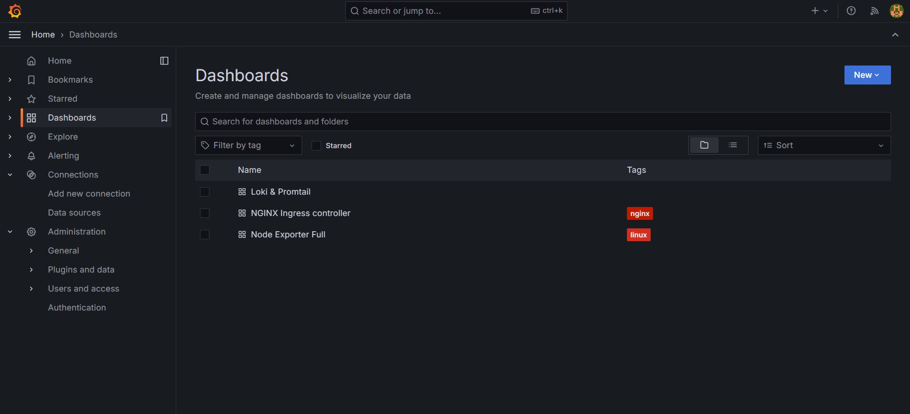
	   
	   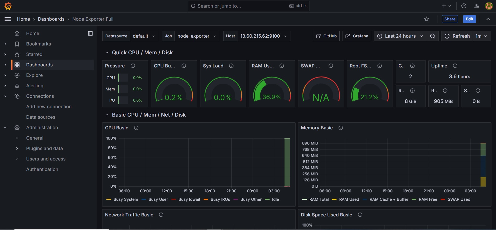
	   
	   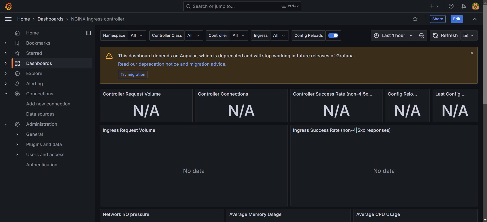
	   
	   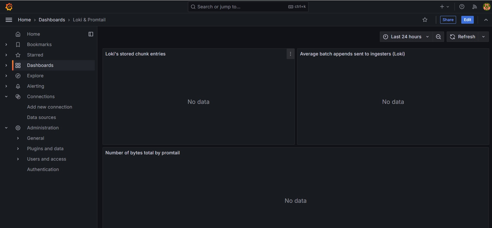
	


