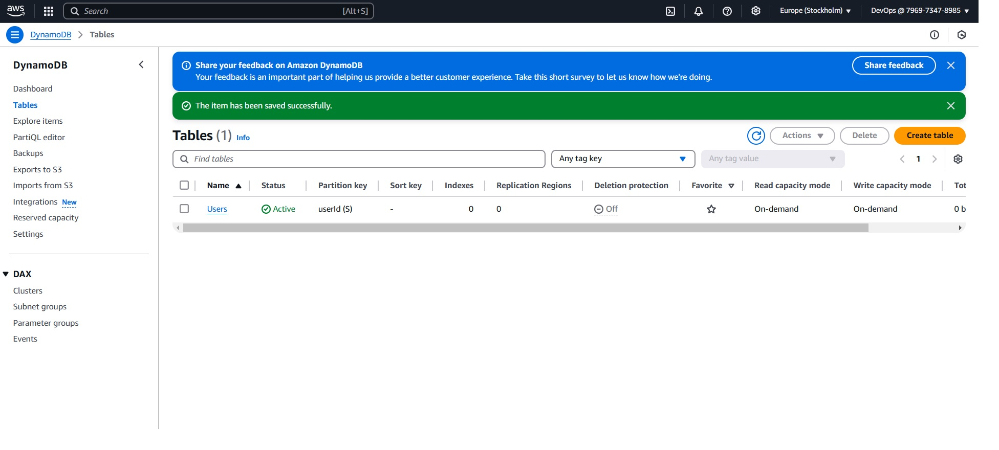
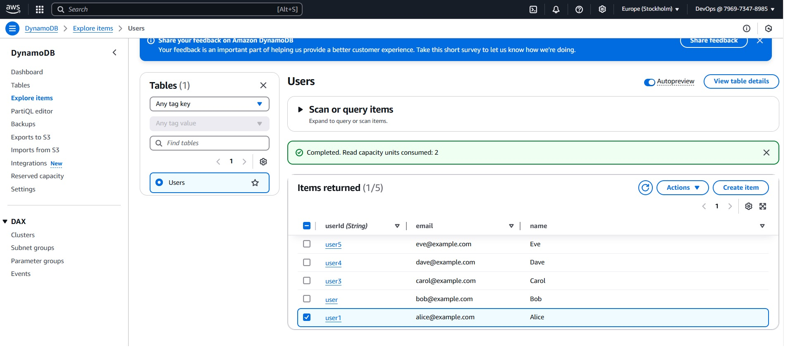
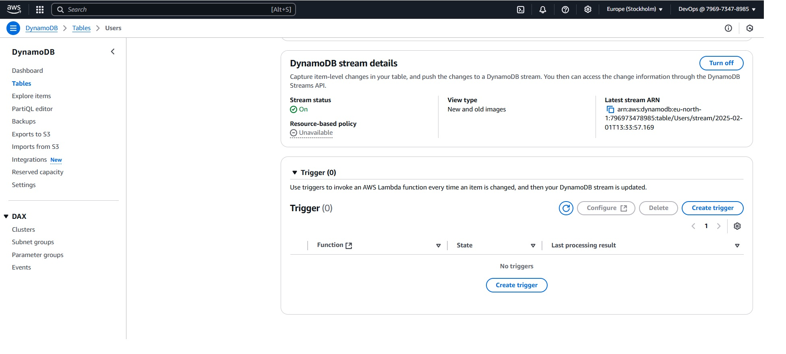
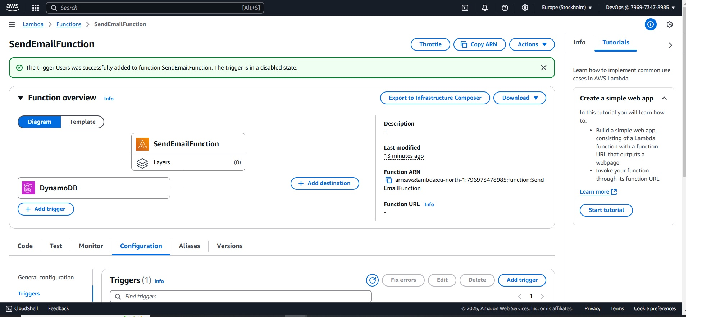
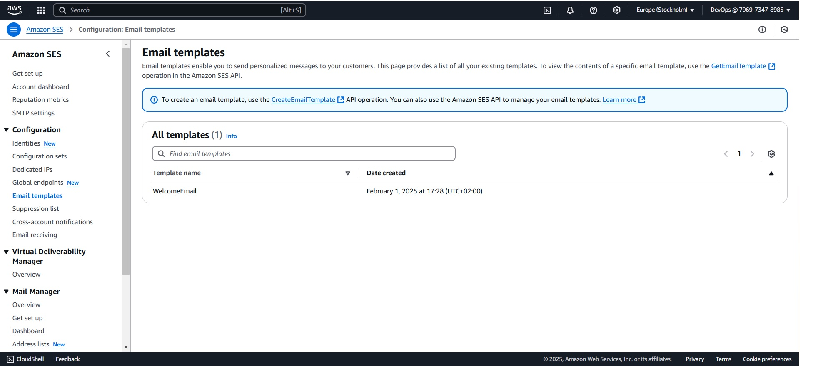
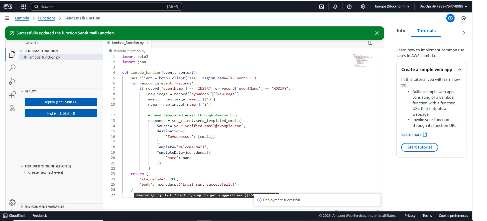
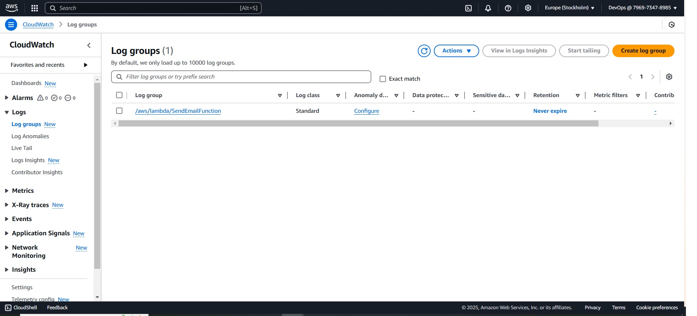
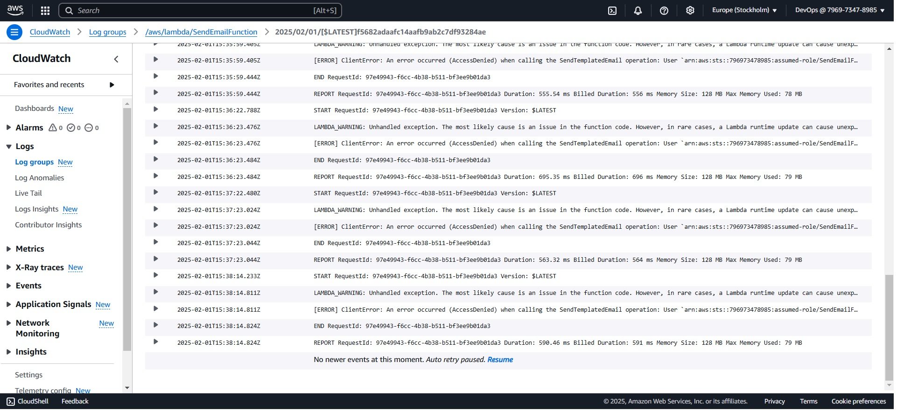

Step 1: Preparing DynamoDB
Created a DynamoDB Table: We created a table named Users to store user data, with a primary key userId of type String.

Added Records: We added records to the table with attributes such as email (user's email address), name (user's name), and any other information needed for the email.

Step 2: Configuring DynamoDB Streams
Enabled DynamoDB Streams: We activated DynamoDB Streams for the Users table to track changes like new records.

Chose Stream View Type: We selected the "New and old images" view type to access complete information about changed records.

Step 3: Creating a Lambda Function
Created a Lambda Function: We created a new Lambda function in the AWS Management Console using Python as the runtime.

Configured the Trigger: We set up a trigger for the Lambda function, choosing DynamoDB Streams as the event source and linking it to the Users table stream.

Granted IAM Permissions: We provided the Lambda function with the necessary IAM role permissions to read from DynamoDB Streams and send emails through Amazon SES.

Step 4: Setting Up Amazon SES
Verified Email Address: We verified our email address or domain in Amazon SES to use it as the sender.

Created an Email Template: We created a standard email template for sending formatted or standardized messages.

Step 5: Writing the Lambda Function Code
Read Events from DynamoDB Streams: The Lambda function reads events from DynamoDB Streams to identify new or updated records.

Format the Email: The function formats an email based on the information received, using the verified email address in SES as the sender.

Send the Email through Amazon SES: The function sends the email using the Amazon SES API.

Testing the Configuration
Added or Modified a Record in DynamoDB: We added or modified a record in the DynamoDB table located in the Stockholm region.

Checked CloudWatch Logs: We navigated to CloudWatch to verify the logs and ensure the Lambda function executed successfully.

